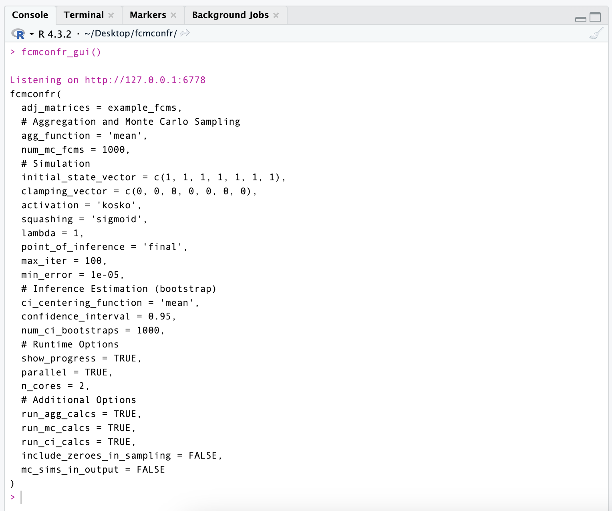
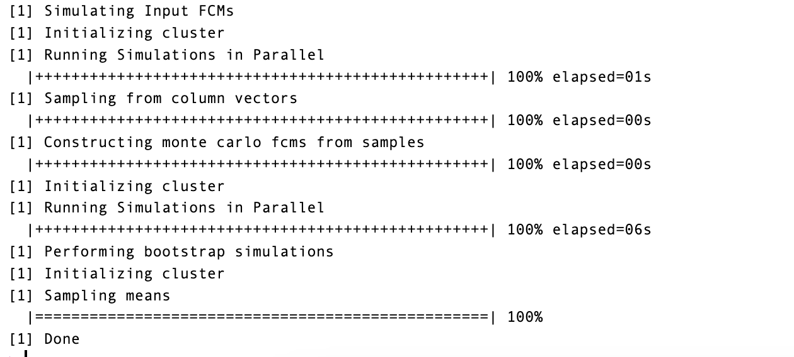

<!-- README.md is generated from README.Rmd. Please edit that file -->

```{r, include = FALSE}
knitr::opts_chunk$set(
  collapse = TRUE,
  comment = "#>",
  fig.path = "man/figures/README-",
  out.width = "100%"
)
```

# fcmconfr

\# fcmconfr \<a href='[https://github.com/bhroston/fcmconfr.git/'](https://github.com/bhroston/fcmconfr.git/')\\</a\>

<!-- badges: start -->

](https://www.repostatus.org/badges/latest/wip.svg)) [](https://codecov.io/gh/bhroston/fcmconfr)[](https://github.com/bhroston/fcmconfr.git/actions?query=workflow%3Apkgcheck)](https://codecov.io/gh/bhroston/fcmconfr/graph/badge.svg?token=D83LF4TC8D)](https://codecov.io/gh/bhroston/fcmconfr)[](https://github.com/bhroston/fcmconfr.git/actions?query=workflow%3Apkgcheck)) [](https://github.com/bhroston/fcmconfr/actions/workflows/R-CMD-check.yaml)](https://github.com/bhroston/fcmconfr/actions/workflows/check-standard.yaml/badge.svg?branch=main)](https://github.com/bhroston/fcmconfr/actions/workflows/R-CMD-check.yaml)) [](https://www.gnu.org/licenses/gpl-3.0)](https://img.shields.io/badge/License-GPLv3-blue.svg)](https://www.gnu.org/licenses/gpl-3.0))

<!-- badges: end -->

The goal of fcmconfr is to is to provide a suite of functions that streamline the analysis of Fuzzy Cognitive Maps (FCMs). Fuzzy Cognitive Maps (FCMs), as introduced in Kosko (1986), are network graphs whose nodes and edges represent causal connections in a system. A key characteristic of FCMs are their capacity to represent causal connections through the language of fuzzy logic, where the strength of causality between nodes may be represented along a spectrum of values as opposed to a simple, binary depiction of the existence of connection between nodes of ordinary Cognitive Map.

FCMs serve as an accessible medium for stakeholders and researchers alike to explore perspectives in systems thinking. However, despite their accessibility as tools for data collection, FCM analysis is mathematically intensive and requires a combination of academic and programming expertise to both navigate the FCM literature and implement the array of algorithms proposed in the theory.

fcmconfr lets users analyze FCMs without the previously described barriers-to-entry. Rather than theoretical and programming expertise, users with moderate experience with the R programming language can use fcmconfr to go straight from data collection and creating FCMs to analyzing results.

## Installation

You can install the development version of fcmconfr from [GitHub](https://github.com/) with:

``` r
# install.packages("pak")
pak::pak("bhroston/fcmconfr")

# OR

# install.packages("remotes")
remotes::install_github("bhroston/fcmconfr")
```

## Example

### Loading Data

FCMs, represented as adjacency matrices, are the fundamental inputs for fcmconfr. Whether stored in .xlsx or .csv files, users will need to load adjacency matrices into R to use fcmconfr. This is an example of loading an adjacency matrix or set of adjacency matrices from an excel file. Follow a similar process for loading from .csv files. Note that multiple FCMs are loaded as a list of multiple FCMs but stored in an individual object.

```{r example, eval=FALSE, include=FALSE}
# Use file.choose to interactively select a file
# excel_filepath <- file.choose()

# For an individual FCM adjacency matrix
adj_matrix <- readxl::read_excel(excel_filepath)

# For multiple FCM adjacency matrices stored in different sheets in the same .xlsx file
sheets <- readxl::excel_sheets(excel_filepath)
adj_matrices <- lapply(
  sheets, 
  function(sheet) readxl::read_excel(excel_filepath, sheet = sheet)
)

# For multiple FCM adjacency matrices stored in different .xlsx files
# excel_filepaths <- c(filepath_1, filepath_2, ..., filepath_n)
adj_matrices <- lapply(
  excel_filepaths,
  function(filepath) readxl::read_excel(filepath)
)
```

### Using fcmconfr

The fcmconfr() function itself takes many inputs, so it is recommended for users to call fcmconfr_gui() to help write the call to fcmconfr with their intended parameters. This example uses the sample_fcms object provided in fcmconfr.

```{r eval=FALSE, include=FALSE}
# Using the sample_fcms object included in the fcmconfr package
example_fcms <- sample_fcms$simple_fcms$conventional_fcms
```

fcmconfr_gui() opens a shiny app that asks the user to select an adjacency matrix or list of adjacency matrices from the Global Environment. Note the sidebar panel arrow to the right of the app. Open this sidebar to see definitions and descriptions for each parameter.

```{r eval=FALSE, include=FALSE}
fcmconfr_gui()
```


Once parameters are selected, scroll down in the app and click the "Submit" button. This outputs an example call to fcmconfr() in the RStudio console that uses the parameters selected by the user in the gui. For example, fcmconfr_gui() may return:



Users can copy-and-paste the generated call to the main fcmconfr() function into a separate file or directly into the console.

```{r eval=FALSE, include=FALSE}
# Copy-and-paste the fcmconfr_gui() output into a variable to explore the results
example_analysis <- fcmconfr(
  adj_matrices = example_fcms,
  # Aggregation and Monte Carlo Sampling
  agg_function = 'mean',
  num_mc_fcms = 1000,
  # Simulation
  initial_state_vector = c(1, 1, 1, 1, 1, 1, 1),
  clamping_vector = c(0, 0, 0, 0, 0, 0, 0),
  activation = 'kosko',
  squashing = 'sigmoid',
  lambda = 1,
  point_of_inference = 'final',
  max_iter = 100,
  min_error = 1e-05,
  # Inference Estimation (bootstrap)
  ci_centering_function = 'mean',
  confidence_interval = 0.95,
  num_ci_bootstraps = 1000,
  # Runtime Options
  show_progress = TRUE,
  parallel = TRUE,
  n_cores = 2,
  # Additional Options
  run_agg_calcs = TRUE,
  run_mc_calcs = TRUE,
  run_ci_calcs = TRUE,
  include_zeroes_in_sampling = FALSE,
  mc_sims_in_output = FALSE
)
```

When running fcmconfr(), the console will output messages to update the user on the function's progress. Depending on the complexity of the inputs and the capacity of the local machine, fcmconfr() can take anywhere from a few seconds to many minutes to run. Note: the progress text will be different depending on inputs to fcmconfr().

{width="428"}

### fcmconfr Outputs

As fcmconfr() performs a collection of analyses on potentially many FCMs, its output is typically a large object to navigate. Use get_inferences(fcmconfr_output_obj) to get a list of organized dataframes for the results of each analysis performed by fcmconfr().

```{r eval=FALSE, include=FALSE}
get_inferences(fcmconfr_obj = example_analysis)
```

Use plot() to plot the analysis' results. Adding interactive = TRUE to the call to plot() loads the figure in a shiny app where users can select sepecific analysis results to display and/or hide. Additional parameters for plot() are given below:

```{r eval=FALSE, include=FALSE}
plot(example_analysis)

# Interact with the plot in a shiny app to display/hide specific analysis results
plot(example_analysis, interactive = TRUE)

# Default parameters for plot.fcmconfr()
plot(example_analysis,
     interactive = FALSE, # Set to TRUE to open shiny app
     # Plot Formatting Parameters
     filter_limit = 1e-4,
     coord_flip = FALSE,
     # Plot Aesthetic Parameters
     mc_avg_and_CIs_color = "blue",
     mc_inferences_color = "blue",
     mc_inferences_alpha = 1,
     mc_inferences_shape = 3, # '+' symbol
     ind_inferences_color = "black",
     ind_inferences_alpha = 1,
     ind_inferences_shape = 16, # small circles
     agg_inferences_color = "red",
     agg_inferences_alpha = 1,
     agg_inferences_shape = 17, # triangles
     ind_ivfn_and_tfn_linewidth = 0.1,
     agg_ivfn_and_tfn_linewidth = 0.6
)
```
