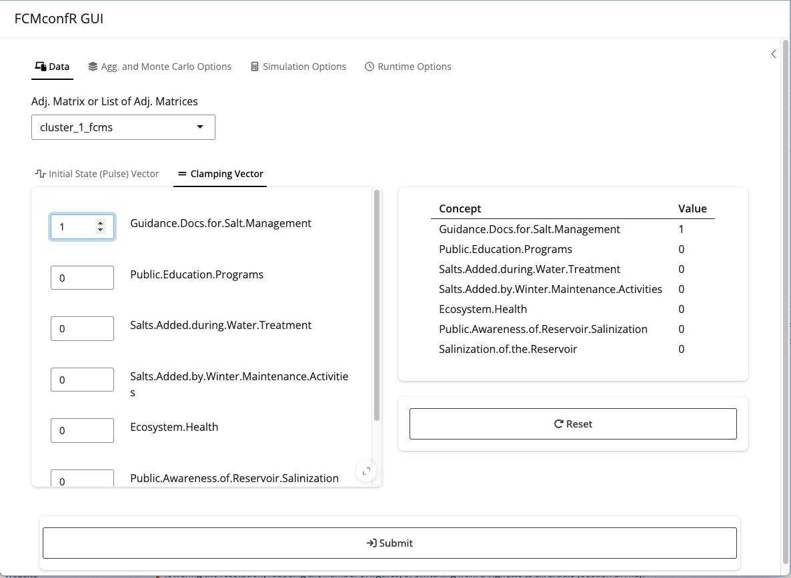
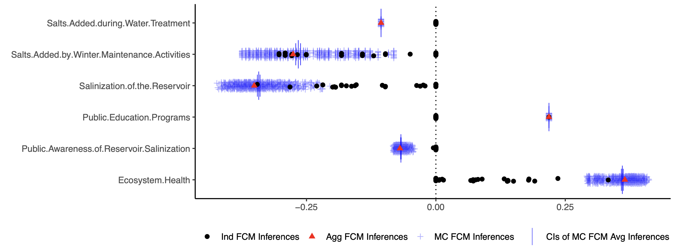

<!-- README.md is generated from README.Rmd. Please edit that file -->

# fcmconfr <a href='https://github.com/bhroston/fcmconfr.git/'</a>

<!-- badges: start -->


[](https://codecov.io/gh/bhroston/fcmconfr)[](https://github.com/bhroston/fcmconfr.git/actions?query=workflow%3Apkgcheck)
[](https://github.com/bhroston/fcmconfr/actions/workflows/R-CMD-check.yaml)
[](https://www.gnu.org/licenses/gpl-3.0)

<!-- badges: end -->

`fcmconfr` streamlines Fuzzy Cognitive Map (FCM) simulation and offers
uncertainty analysis features using Monte Carlo methods. Interval-Value
Fuzzy Numbers (IVFNs), and Triangular Fuzzy Numbers (TFNs).

FCM simulation and uncertainty analysis methods vary with most requiring
programming and mathematical backgrounds (alongside a potentially
lengthy amount of time to spare) to implement for there own uses.

The `fcmconfr` package gives researchers accessible tools to simulate
FCMs and incorporate uncertainty in their analyses with just a few
function calls. Developed with a strong focus on accessibility
(ease-of-use), `fcmconfr` aims to give users a more direct route to
interact with FCMs in their projects.

## Installation

You can install the development version of fcmconfr from
[GitHub](https://github.com/) with:

``` r
# install.packages("pak")
pak::pak("bhroston/fcmconfr")
# Or
remotes::install_github("bhroston/fcmconfr")
```

## Example

A typical `fcmconfr` workflow follows a four-step process:

1.  Import FCMs

2.  Set simulation parameters using `fcmconfr_gui()`

3.  Run simulations using `fcmconfr()`

4.  Explore outputs using `get_inferences()` and `plot()`

See `vignette("fcmconfr", package = "fcmconfr")` for a thorough
walkthrough of each of the above steps.

### 1. Import FCMs

FCMs are fundamentally matrix objects and can be imported into R as such
using functions like `readxl::read_excel()`, `read.csv()`, etc.

See `vignette("Importing_FCMs", package = "fcmconfr")` for a detailed
guide on importing conventional FCMs, FCMs with edge weights represented
as IVFNs (IVFN-FCMs), and FCMs with edge weights represented as TFNs
(TFN-FCMs).

### 2. Set Simulation Parameters using `fcmconfr_gui()`

The primary `fcmconfr()` function is the central function of the package
and requires specifying many different parameters. The `fcmconfr_gui()`
function is intended to help guide users through that process.

<div style="text-align: center;">



</div>

Calling `fcmconfr_gui()` launches a Shiny app that lets users
interactively select parameters and returns a corresponding call to
`fcmconfr()` in the console that users can copy-and-paste to run in
their own scripts.

Note: A brief summary of each parameter within the `fcmconfr_gui()` is
provided in a glossary stored in a side tab within the GUI. The side tab
can be opened by clicking the arrow symbol in the top-right-hand-corner
of the GUI.

### 3. Run Simulations using `fcmconfr()`

`fcmconfr_gui()` does all the hard work of putting together the call to
`fcmconfr()`. Running `fcmconfr()` is now as simple as executing that
output script.

The following uses an example FCM from the `sample_fcms` data included
in the package.

``` r
# This call to fcmconfr() was generated from fcmconfr_gui()!
# Store the output in a variable to explore it later
fcmconfr_obj <- fcmconfr(
    adj_matrices = sample_fcms$simple_fcms$conventional_fcms,
    # Aggregation and Monte Carlo Sampling
    agg_function = 'mean',
    num_mc_fcms = 1000,
    # Simulation
    initial_state_vector = c(1, 1, 1, 1, 1, 1, 1),
    clamping_vector = c(1, 0, 0, 0, 0, 0, 0),
    activation = 'rescale',
    squashing = 'sigmoid',
    lambda = 1,
    point_of_inference = 'final',
    max_iter = 100,
    min_error = 1e-05,
    # Inference Estimation (bootstrap)
    ci_centering_function = 'mean',
    confidence_interval = 0.95,
    num_ci_bootstraps = 1000,
    # Runtime Options
    show_progress = TRUE,
    parallel = TRUE,
    n_cores = 2,
    # Additional Options
    run_agg_calcs = TRUE,
    run_mc_calcs = TRUE,
    run_ci_calcs = TRUE,
    include_zeroes_in_sampling = FALSE,
    include_sims_in_output = FALSE
  )
```

### 4. Explore `fcmconfr()` Results

The `fcmconfr()` output is a large object that contains a lot of data,
so the package includes additional functions to help users identify and
explore its most important components.

Simulation inferences are the main output from `fcmconfr()` as they
indicate how much each node is influenced by a particular change or
action. The `get_inferences()` function gives users access to that data
without having to parsing through the `fcmconfr()` output directly.

``` r
fcmconfr_inferences <- get_inferences(fcmconfr_obj)
```

A plot of all inferences can be generated using the `plot()` command.

``` r
plot(fcmconfr_obj)
```

<div style="text-align: center;">



</div>

Note: `plot()` is unique in that its documentation must be accessed via
`?plot.fcmconfr` (`?plot` returns the documentation for the Base R
version of the function).

## Related Packages

- The
  [`fcm`](https://search.r-project.org/CRAN/refmans/fcm/html/fcm.html) R
  package offers the `fcm.infer()` function to simulate FCMs.
- [`PyFCM`](https://github.com/payamaminpour/PyFCM) is a Python package
  that includes functions for FCM simulation and aggregation.
- [`jFCM`](https://github.com/megadix/jfcm?tab=readme-ov-file) is a
  java-based suite of functions to simulate FCMs.

## Contributing

Please note that this package is released with a [Contributor Code of
Conduct](https://ropensci.org/code-of-conduct/). By contributing to this
project, you agree to abide by its terms.

- If you think you have encountered a bug, please [submit an
  issue](https://github.com/bhroston/fcmconfr/issues).

- Please include a
  [reprex](https://reprex.tidyverse.org/articles/articles/learn-reprex.html)
  (a minimal, reproducible example) to clearly communicate about your
  code.
