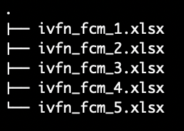
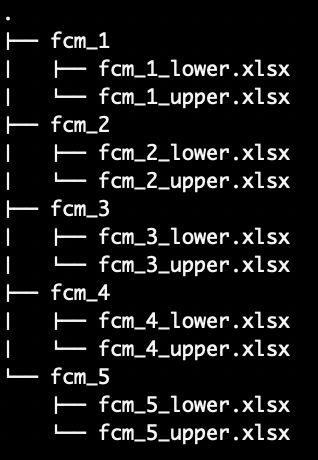
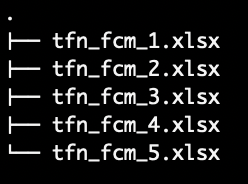
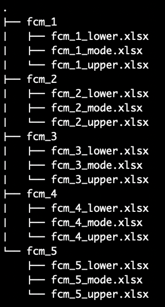
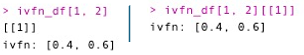

```{r include = FALSE}
knitr::opts_chunk$set(
  collapse = TRUE,
  comment = "#>"
)

```

```{r eval=FALSE}
library(fcmconfr)
```

# Loading FCMs into R for fcmconfr

Imagine asking a stakeholder to provide a weight for the edge (link) connecting *Sunscreen Application* to *Likelihood of Sunburn*. In the conventional FCM framework (like that implemented by [MentalModeler](https://www.mentalmodeler.com/) , a popular FCM construction and analysis application) edge weights are weighted with individual values. So, in the example, a stakeholder may weight the edge connecting *Sunscreen Application* to *Likelihood of Sunburn* as -0.4 or -0.5, or - 0.6 or any other value that broadly describes that as *Sunscreen Application* increases they expect the *Likelihood of Sunburn* to decrease some amount.

::: {style="text-align: center;"}
{width="100%"}
:::

<br>

A limitation of requiring the stakeholder to assign the edge weight a single value that they may not feel comfortable describing the connection with such precision. Rather than saying an edge weight may be either -0.4 or -0.5 or -0.6, they may prefer describing an edge weight with a range of values (e.g. somewhere between -0.4 and -0.6).

FCMs may describe these edge weights using Interval-Value Fuzzy Numbers (IVFNs) which are defined by two values, the minimum and maximum value of an interval (e.g. [-0.6, -0.4]. Further, they may feel confident enough to suggest an edge may exist within some range but is more likely to be a particular value within that range. These edge weights may be described using minimum and maximum bounds of a range and a mode value describing the most likely value (i.e. mode) the edge weight could take.

The figure below illustrates conventional numeric edge weights, IVFNs, and TFNs as probability density functions (PDFs). Note how the PDF for an IVFN can be described completely with only a lower and upper bound, while the pdf for a TFN includes an additional mode parameter to describe the most likely value of the distribution.

::: {style="text-align: center;"}
{width="100%"}
:::

## 1. Conventional FCMs

Conventional FCMs use individual numeric values as edge weights. The below examples show how to load these FCMs from .xlsx files, but a similar process is used for .csv, .xml or other file types.

Note: Use `file.choose()` to get the path to a file interactively. There is not a similar function to get the path to a directory, but users may extrapolate from the output of `file.choose()` as needed.

#### 1.1 - Conventional FCM from a Single .xlsx File

```{r eval=FALSE,include=FALSE}
filepath <- filepath <- system.file(
  file.path("vignette_example_data", "conventional_fcms", "sample_conventional_fcms.xlsx"),
  package = "fcmconfr"
)
```

```{r eval=FALSE}
# For an individual FCM adjacency matrix
adj_matrix <- readxl::read_excel(filepath)
```

#### 1.1 - Conventional FCMs from Different Sheets in a Single .xlsx File

```{r eval=FALSE}
# For multiple FCM adjacency matrices stored in different sheets in the same .xlsx file
sheets <- readxl::excel_sheets(filepath)
adj_matrices <- lapply(
  sheets, 
  function(sheet) readxl::read_excel(filepath, sheet = sheet)
)
```

#### 1.2 - Conventional FCMs from .xlsx Files in a Directory

```{r eval=FALSE,include=FALSE}
directory_path <- system.file(
  file.path("vignette_example_data", "conventional_fcms", "conventional_fcms_dir"),
  package = "fcmconfr"
)
   # You directory path here
```

```{r eval=FALSE}
# For multiple FCM adjacency matrices stored in separate .xlsx files stored in the
# same directory
filepaths <- list.files(directory_path, full.names = TRUE)
adj_matrices <- lapply(
  filepaths,
  function(filepath) readxl::read_excel(filepath)
)
```

## 2. IVFN FCMs

IVFN FCMs are more complicated data objects because edge weights are described by two values (an upper and lower bound) but common file formats like .xlsx and .csv can only store one value per cell (or similar for .csv and others).

#### 2.1 - Using `make_adj_matrix_w_ivfns`

We recommend creating an IVFN FCM from two adjacency matrices, one with edge weights as the intended lower bounds and one with edge weights as the intended upper bounds. Then, use `make_adj_matrix_w_ivfns` to construct an IVFN FCM adjacency matrix.

##### 2.1.1 - `make_adj_matrix_w_ivfns` from a Single .xlsx. File

```{r eval=FALSE,include=FALSE}
filepath <- system.file(
  file.path("vignette_example_data", "ivfn_fcms", "sample_ivfn_fcm.xlsx"),
  package = "fcmconfr"
)
```

If loading an IVFN FCM from a single .xlsx file, the file must contain two sheets, one for the lower bounds adjacency matrix and one for the upper bounds adjacency matrix.

```{r eval=FALSE}
sheets <- readxl::excel_sheets(filepath)

# If lower and upper adjacency matrices are in the same .xlsx file across two different sheets
lower_and_upper_adj_matrices <- lapply(
  sheets, 
  function(sheet) readxl::read_excel(filepath, sheet = sheet)
)
lower_adj_matrix <- lower_and_upper_adj_matrices[[1]]
upper_adj_matrix <- lower_and_upper_adj_matrices[[2]]

ivfn_adj_matrix <- make_adj_matrix_w_ivfns(lower_adj_matrix, upper_adj_matrix)
```

##### 2.1.2 - `make_adj_matrix_from_ivfns` from Separate .xlsx Files in the Same Directory

```{r eval=FALSE,include=FALSE}
directory_path <- system.file(
  file.path("vignette_example_data", "ivfn_fcms", "ivfn_fcm_dirs", "fcm_1"),
  package = "fcmconfr"
)
```

Use this method if loading data from separate .csv, .xml, etc., files that by nature cannot contain multiple sheets in the same file.

```{r eval=FALSE}
# If lower and upper adjacency matrices are in separate .xlsx files
lower_adj_matrix_filepath <- file.path(directory_path, "fcm_1_lower.xlsx") # Your filename here
upper_adj_matrix_filepath <- file.path(directory_path, "fcm_1_upper.xlsx") # Your filename here

lower_adj_matrix <- readxl::read_excel(lower_adj_matrix_filepath)
upper_adj_matrix <- readxl::read_excel(upper_adj_matrix_filepath)

ivfn_adj_matrix <- make_adj_matrix_w_ivfns(lower_adj_matrix, upper_adj_matrix)
```

#### 2.2 - IVFN FCMs from a Directory of Adj. Matrices in Single .xlsx Files

::: {style="text-align: center;"}
{width="24%"}
:::

<br>

```{r eval=FALSE,include=FALSE}
directory_path <- system.file(
  file.path("vignette_example_data", "ivfn_fcms", "ivfn_fcm_ind_files"),
  package = "fcmconfr"
)
```

Load the following function into the Global Environment to run the example workflow in fewer lines of code or repetitively in a `for` loop or using `lapply()`.

```{r eval=FALSE}
# Load into Global Environment to streamline IVFN FCM imports from individual .xlsx files
import_ivfn_fcm_from_single_xlsx <- function(filepath) {
  sheets <- readxl::excel_sheets(filepath)

  lower_and_upper_adj_matrices <- lapply(
    sheets, 
    function(sheet) readxl::read_excel(filepath, sheet = sheet)
  )

  ivfn_adj_matrix <- make_adj_matrix_w_ivfns(
    lower_and_upper_adj_matrices[[1]], lower_and_upper_adj_matrices[[2]]
  )
  
  ivfn_adj_matrix
}
```

Then, call the newly-defined `import_ivfn_fcm_from_single_xlsx` function within `lapply` or a loop.

```{r eval=FALSE}
# For multiple IVFN FCM adjacency matrices stored in separate .xlsx files stored in the
# same directory
filepaths <- list.files(directory_path, full.names = TRUE)
ivfn_adj_matrices <- lapply(
  filepaths,
  function(filepath) import_ivfn_fcm_from_single_xlsx(filepath)
)
```

#### 2.3 - IVFN FCMs from a Adj. Matrices in Separate .xlsx Files Stored in Different Directories

::: {style="text-align: center;"}
{width="26%"}
:::

<br>

```{r eval=FALSE,include=FALSE}
directory_path <- system.file(
  file.path("vignette_example_data", "ivfn_fcms", "ivfn_fcm_dirs"),
  package = "fcmconfr"
)
```

Load the following function into the Global Environment to run the example workflow in fewer lines of code or repetitively in a `for` loop or using `lapply()`.

```{r eval=FALSE}
# Load into Global Environment to streamline IVFN FCM imports from two .xlsx files
import_ivfn_fcm_from_two_xlsx_files <- function(lower_adj_matrix_filepath,
                                                upper_adj_matrix_filepath) {

  # Use read.csv or similar for other file types
  lower_adj_matrix <- readxl::read_excel(lower_adj_matrix_filepath)
  upper_adj_matrix <- readxl::read_excel(upper_adj_matrix_filepath)

  ivfn_adj_matrix <- make_adj_matrix_w_ivfns(lower_adj_matrix, upper_adj_matrix)
  
  ivfn_adj_matrix
}
```

Then, call the newly-defined `import_ivfn_fcm_from_two_xlsx_files` function within `lapply` or a loop.

```{r eval=FALSE}
# For IVFN FCM adjacency matrices stored in separate .xlsx files across different directories
directory_paths <- file.path(directory_path, list.files(directory_path)) # Note list.files shows dirs here

ivfn_adj_matrices <- lapply(
  directory_paths,
  function(directory_path) {
    ivfn_files <- list.files(directory_path)
    
    lower_ivfn_adj_matrix_file <- ivfn_files[[1]] # Order as needed or by filename
    upper_ivfn_adj_matrix_file <- ivfn_files[[2]] # Order as needed or by filename
    
    lower_ivfn_adj_matrix_filepath <- file.path(directory_path, lower_ivfn_adj_matrix_file)
    upper_ivfn_adj_matrix_filepath <- file.path(directory_path, upper_ivfn_adj_matrix_file)
    
    imported_ivfn_adj_matrices <- import_ivfn_fcm_from_two_xlsx_files(
      lower_ivfn_adj_matrix_filepath,
      upper_ivfn_adj_matrix_filepath
    )
    imported_ivfn_adj_matrices
  }
)
```

## 3. TFN FCMs

TFN FCMs are the most complicated edge weights because they are described by three values, an upper and lower bound as well as a mode describing the most-likely value for the edge. TFN FCMs are imported using a similar strategy as with IVFN FCMs, just with the added mode adjacency matrix to load.

#### 3.1 - Using `make_adj_matrix_w_tfns`

TFN FCMs are constructed from three adjacency matrices, an adjacency matrix of lower bounds, one of upper bounds, and another of modes or most-likely values. Use `make_adj_matrix_w_tfns` to combine the three input matrices into a TFN FCM.

##### 3.1.1 - `make_adj_matrix_w_tfns` from a Single .xlsx. File

```{r eval=FALSE,include=FALSE}
filepath <- system.file(
  file.path("vignette_example_data", "tfn_fcms", "sample_tfn_fcm.xlsx"),
  package = "fcmconfr"
)
```

If loading an TFN FCM from a single .xlsx file, the file must contain three sheets, one for the lower bounds adjacency matrix, one for the upper bounds adjacency matrix, and another for the modes adjacency matrix.

```{r eval=FALSE}
sheets <- readxl::excel_sheets(filepath)

# If lower and upper adjacency matrices are in the same .xlsx file across two different sheets
lower_mode_and_upper_adj_matrices <- lapply(
  sheets, 
  function(sheet) readxl::read_excel(filepath, sheet = sheet)
)
lower_adj_matrix <- lower_mode_and_upper_adj_matrices[[1]]
mode_adj_matrix <- lower_mode_and_upper_adj_matrices[[2]]
upper_adj_matrix <- lower_mode_and_upper_adj_matrices[[3]]

tfn_adj_matrix <- make_adj_matrix_w_tfns(lower_adj_matrix, mode_adj_matrix, upper_adj_matrix)
```

##### 3.1.2 - `make_adj_matrix_from_tfns` from Separate .xlsx Files in the Same Directory

```{r eval=FALSE,include=FALSE}
directory_path <- system.file(
  file.path("vignette_example_data", "tfn_fcms", "tfn_fcm_dirs", "fcm_1"),
  package = "fcmconfr"
)
```

Use this method if loading data from separate .csv, .xml, etc., files that by nature cannot contain multiple sheets in the same file.

```{r eval=FALSE}
# If lower, mode, and upper adjacency matrices are in separate .xlsx files
lower_adj_matrix_filepath <- file.path(directory_path, "fcm_1_lower.xlsx") # Your filename here
mode_adj_matrix_filepath <- file.path(directory_path, "fcm_1_mode.xlsx") # Your filename here
upper_adj_matrix_filepath <- file.path(directory_path, "fcm_1_upper.xlsx") # Your filename here

lower_adj_matrix <- readxl::read_excel(lower_adj_matrix_filepath)
mode_adj_matrix <- readxl::read_excel(mode_adj_matrix_filepath)
upper_adj_matrix <- readxl::read_excel(upper_adj_matrix_filepath)

tfn_adj_matrix <- make_adj_matrix_w_tfns(lower_adj_matrix, mode_adj_matrix, upper_adj_matrix)
```

#### 3.2 - TFN FCMs from a Directory of Adj. Matrices in Single .xlsx Files

::: {style="text-align: center;"}
{width="28%"}
:::

<br>

```{r eval=FALSE,include=FALSE}
directory_path <- system.file(
  file.path("vignette_example_data", "tfn_fcms", "tfn_fcm_ind_files"),
  package = "fcmconfr"
)
```

Load the following function into the Global Environment to run the example workflow in fewer lines of code or repetitively in a `for` loop or using `lapply()`.

```{r eval=FALSE}
# Load into Global Environment to streamline TFN FCM imports from individual .xlsx files
import_tfn_fcm_from_single_xlsx <- function(filepath) {
  sheets <- readxl::excel_sheets(filepath)

  lower_mode_and_upper_adj_matrices <- lapply(
    sheets, 
    function(sheet) readxl::read_excel(filepath, sheet = sheet)
  )

  tfn_adj_matrix <- make_adj_matrix_w_tfns(
    lower_mode_and_upper_adj_matrices[[1]],
    lower_mode_and_upper_adj_matrices[[2]],
    lower_mode_and_upper_adj_matrices[[3]]
  )
  
  tfn_adj_matrix
}
```

Then, call the newly-defined `import_tfn_fcm_from_single_xlsx` function within `lapply` or a loop.

```{r eval=FALSE}
# For multiple IVFN FCM adjacency matrices stored in separate .xlsx files stored in the
# same directory
filepaths <- list.files(directory_path, full.names = TRUE)
tfn_adj_matrices <- lapply(
  filepaths,
  function(filepath) import_tfn_fcm_from_single_xlsx(filepath)
)
```

#### 3.3 - TFN FCMs from a Adj. Matrices in Separate .xlsx Files Stored in Different Directories

::: {style="text-align: center;"}
{width="30%"}
:::

<br>

```{r eval=FALSE,include=FALSE}
directory_path <- system.file(
  file.path("vignette_example_data", "tfn_fcms", "tfn_fcm_dirs"),
  package = "fcmconfr"
)
```

Load the following function into the Global Environment to run the example workflow in fewer lines of code or repetitively in a `for` loop or using `lapply()`.

```{r eval=FALSE}
# Load into Global Environment to streamline tFN FCM imports from two .xlsx files
import_tfn_fcm_from_two_xlsx_files <- function(lower_adj_matrix_filepath,
                                               mode_adj_matrix_filepath,
                                               upper_adj_matrix_filepath) {

  # Use read.csv or similar for other file types
  lower_adj_matrix <- readxl::read_excel(lower_adj_matrix_filepath)
  mode_adj_matrix <- readxl::read_excel(mode_adj_matrix_filepath)
  upper_adj_matrix <- readxl::read_excel(upper_adj_matrix_filepath)

  tfn_adj_matrix <- make_adj_matrix_w_tfns(
    lower_adj_matrix, mode_adj_matrix, upper_adj_matrix
  )
  
  tfn_adj_matrix
}
```

Then, call the newly-defined `import_tfn_fcm_from_two_xlsx_files` function within `lapply` or a loop.

```{r eval=FALSE}
# For TFN FCM adjacency matrices stored in separate .xlsx files across different directories
directory_paths <- file.path(directory_path, list.files(directory_path)) # Note list.files shows dirs here

tfn_adj_matrices <- lapply(
  directory_paths,
  function(directory_path) {
    tfn_files <- list.files(directory_path)
    
    lower_tfn_adj_matrix_file <- tfn_files[[1]] # Order as needed or by filename
    mode_tfn_adj_matrix_file <- tfn_files[[2]] # Order as needed or by filename
    upper_tfn_adj_matrix_file <- tfn_files[[3]] # Order as needed or by filename
    
    lower_tfn_adj_matrix_filepath <- file.path(directory_path, lower_tfn_adj_matrix_file)
    mode_tfn_adj_matrix_filepath <- file.path(directory_path, mode_tfn_adj_matrix_file)
    upper_tfn_adj_matrix_filepath <- file.path(directory_path, upper_tfn_adj_matrix_file)
    
    imported_tfn_adj_matrices <- import_tfn_fcm_from_two_xlsx_files(
      lower_tfn_adj_matrix_filepath,
      mode_tfn_adj_matrix_filepath,
      upper_tfn_adj_matrix_filepath
    )
    imported_tfn_adj_matrices
  }
)
```

## 4. Interacting with IVFN and TFN FCM Adjacency Matrix Elements

Unlike an ordinary matrix of numeric values, elements adjacency matrices made of IVFNs are technically list objects. Consider the `numeric_df` matrix given below:

```{r eval=FALSE}
numeric_df <- data.frame("C1" = c(0, 0.75), "C2" = c(0.5, 0))
numeric_df
```

We can access elements within `numeric_df` with indexing. For example, to get the element in the second column of the first row we can run `numeric_df[1, 2]` or `numeric_df$C2[1]` , both of which would return `0.5` .

```{r eval=FALSE}
numeric_df[1, 2] # Numeric Indexing
numeric_df$C2[1] # Column Indexing
```

Dataframes traditionally cannot be built from custom object classes like the `ivfn` and `tfn` classes defined for `fcmconfr`. However, `fcmconfr` works around this by storing `ivfn` and `tfn` objects within lists and then treating a dataframe of `ivfn` or `tfn` objects as a dataframe of lists that contain `ivfn` or `tfn` objects.

Since users can make `ivfn` or `tfn` adjacency matrices by importing matrices from files, they will rarely have to create an `ivfn` or `tfn` matrix from scratch, but it is valuable to provide a code example of how `fcmconfr` creates such objects.

```{r eval=FALSE}
# First, create a dataframe from a n x n matrix of lists
ivfn_df <- data.frame(matrix(data = list(), nrow = 2, ncol = 2))

# Then, place the ivfn/tfn within a list and define its location indeces
# Note that since ivfn_df is a matrix of lists, we have to define the new ivfn object as the first element of the list at index [1, 2], hence the need for [[1]].
ivfn_df[1, 1][[1]] <- list(ivfn(0, 0))
ivfn_df[1, 2][[1]] <- list(ivfn(0.4, 0.6))
ivfn_df[2, 1][[1]] <- list(ivfn(0.7, 0.8))
ivfn_df[2, 2][[1]] <- list(ivfn(0, 0))
```

::: {style="text-align: center;"}
{width="70%"}
:::

<br>

To get the `ivfn` at a particular location, then, if we simply call `ivfn_df[row, col]` that will return a list containing an `ivfn`. To get the `ivfn` by itself, add `[[1]]` to indicate the first value of the list object

::: {style="text-align: center;"}
{width="50%"}
:::

<br>

Now, say we want to separate the IVFN adjacency matrix back to its components of an adjacency matrix of lower bounds and another of upper bounds. Pairing `apply` with the above indexing strategy is an effective method here:

```{r eval=FALSE}
lower_adj_matrix <- apply(ivfn_df, c(1, 2), function(element) element[[1]]$lower)
upper_adj_matrix <- apply(ivfn_df, c(1, 2), function(element) element[[1]]$upper)
```
