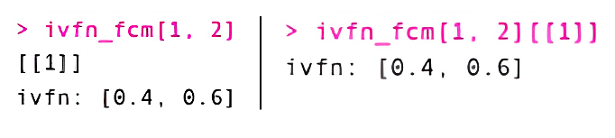
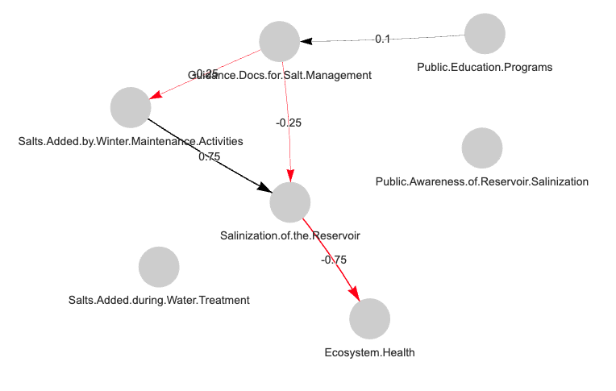

```{r, include = FALSE}
knitr::opts_chunk$set(
  collapse = TRUE,
  comment = "#>"
)
```

```{r eval=FALSE}
library(fcmconfr)
```

# The `fcmconfr` Workflow

`fcmconfr` streamlines the process of conducting dynamic simulations using fuzzy cognitive maps (FCMs). The package can (1) analyze different types of FCMs (conventional, interval-value fuzzy number, and triangular fuzzy number), (2) perform dynamic simulations on one or more individual FCMs, (3) aggregate individual FCMs so that dynamic simulations can be performed on the aggregate, and (4) estimate uncertainty using Monte Carlo approaches. A typical fcmconfer workflow includes the following four steps:

1.  Import FCMs

2.  Set simulation parameters using `fcmconfr_gui()`

3.  Run simulations using `fcmconfr()`

4.  Explore outputs using `get_inferences()` and `plot()`

This guide walks through each of these steps, from data import to visualization.

Note: This guide frequently references data from the `sample_fcms` object that users can access after loading `fcmconfr` via `library(fcmconfr)`.

## 1. Import FCMs

`fcmconfr` can handle three different types of FCMs: (1) conventional, where each edge weight is represented using numeric values, (2) interval-value fuzzy number FCMs (IVFN-FCMs), where each edge weight is represented using two numeric values (lower bound, upper bound; i.e., an IVFN), and (3) triangular fuzzy number FCMs (TFN-FCMs), where each edge weight is represented using three numeric values (lower bound, mode, upper bound; i.e., a TFN).

*A detailed guide for importing each FCM type in a maner compatible with `fcmconfr` has been provided in a separate, companion vignette (Importing_FCMs). A brief description of the typical workflow used to import each FCM type has been provided below.*

### 1.1 Importing Conventional FCMs

Conventional FCMs can be imported as adjacency matrices, either from excel or csv files using standard import functions (e.g., calls to `readxl::read_excel()` or `read.csv()`). Users who plan to use `fcmconfr` to analyze multiple FCMs together should group them into a single `list` object.

```{r eval=FALSE}
# Import Conventional FCMs into the Global Environment
fcm_1 <- readxl::read_excel(fcm_1_filepath)
fcm_2 <- readxl::read_excel(fcm_2_filepath)
...
fcm_n <- readxl::read_excel(fcm_n_filepath)

# Group them together in a single list object
fcms <- list(fcm_1, fcm_2, ..., fcm_n)
```

### 1.2 Importing IVFN FCMs

Because IVFN-FCMs have interval edge weights with lower and upper bounds, separate adjacency matrices must be created and uploaded for each bound (lower and upper). We can then use the `fcmconfr` function `make_adj_matrix_w_ivfns()` to combine the two, creating a single adjacency matrix with interval edge weights. As noted previously for conventional FCMs, users who plan to analyze multiple IVFN FCMs together should group them into a single list object.

```{r eval=FALSE}
# Import separate adjacency matrices representing the 
# lower and upper bounds of each edge weight
ivfn_fcm_1_lower_adj_matrix <- readxl::read_excel(ivfn_fcm_1_lower_adj_matrix_filepath)
ivfn_fcm_1_upper_adj_matrix <- readxl::read_excel(ivfn_fcm_1_upper_adj_matrix_filepath)

# Combine the lower and upper adjacency matrices to make an IVFN FCM
ivfn_fcm_1 <- make_adj_matrix_w_ivfns(
  ivfn_fcm_1_lower_adj_matrix, ivfn_fcm_1_upper_adj_matrix
)

# To analyze multiple IVFN FCMs, group them together 
# in a single list object
ivfn_fcms <- list(ivfn_fcm_1, ivfn_fcm_2, ..., ivfn_fcm_n)
```

### 1.3 Importing TFN FCMs

The workflow for importing TFN FCMs is comparable to the workflow for IVFN FCMs. The main differences are (1) the need to upload three adjacency matrices rather than two (one for the lower bound, one for the mode, and one for the upper bound) and (2) the function call to combine these matrices is `make_adj_matrix_w_tfns()` (rather than `make_adj_matrix_w_ivfns()`). As noted previously, users who plan to analyze multiple TFN-FCMs together should group them into a single `list` object.

```{r eval=FALSE}
# Import separate adjacency matrices representing the 
# lower and upper bounds as well as the mode  of each edge weight
ivfn_fcm_1_lower_adj_matrix <- readxl::read_excel(ivfn_fcm_1_lower_adj_matrix_filepath)
ivfn_fcm_1_mode_adj_matrix <- readxl::read_excel(ivfn_fcm_1_mode_adj_matrix_filepath)
ivfn_fcm_1_upper_adj_matrix <- readxl::read_excel(ivfn_fcm_1_upper_adj_matrix_filepath)

# Combine the lower and upper adjacency matrices to make an IVFN FCM
tfn_fcm_1 <- make_adj_matrix_w_tfns(
  tfn_fcm_1_lower_adj_matrix, tfn_fcm_1_mode_adj_matrix, tfn_fcm_1_upper_adj_matrix
)

# To analyze multiple TFN-FCMs, group them together
# in a single list object
tfn_fcms <- list(tfn_fcm_1, tfn_fcm_2, ..., tfn_fcm_n)
```

### 1.4 Interacting with IVFN and TFN FCM Adjacency Matrix Elements

Since users can make IVFN or TFN adjacency matrices by importing matrices from files, they will rarely have to create an IVFN or TFN matrix from scratch, but it is valuable to provide a code example of how `fcmconfr` creates such objects. The example we provide below is for an IVFN matrix. The approach for a TFN matrix is similar, but uses three- rather than two-element lists.

```{r eval=FALSE}
# First, create a dataframe from a n x n matrix of lists
ivfn_fcm <- data.frame(matrix(data = list(), nrow = 2, ncol = 2))

# Then, place the ivfn/tfn within a list and define its location indices
# Note that since ivfn_df is a matrix of lists, we have to define the new 
# ivfn object as the first element of the list at index [1, 2], hence the
# need for [[1]] at the end.
ivfn_fcm[1, 1][[1]] <- list(ivfn(0, 0))
ivfn_fcm[1, 2][[1]] <- list(ivfn(0.4, 0.6))
ivfn_fcm[2, 1][[1]] <- list(ivfn(0.7, 0.8))
ivfn_fcm[2, 2][[1]] <- list(ivfn(0, 0))
```

::: {style="text-align: center;"}
{width="70%"}
:::

<br>

To report the IVFN of a particular edge within an IVFN matrix, we can call `ivfn_fcm[row, col]` which returns a `list` object or `ivfn_fcm[row, col][[1]]` to return the first value record in the `list` object, the IVFN itself.

::: {style="text-align: center;"}
{width="50%"}
:::

<br>

To decompose an IVFN matrix into its upper and lower bounds, we can run the following:

```{r eval=FALSE}
lower_adj_matrix <- apply(ivfn_df, c(1, 2), function(element) element[[1]]$lower)
upper_adj_matrix <- apply(ivfn_df, c(1, 2), function(element) element[[1]]$upper)
```

### 1.5 Viewing FCMs

Users may display FCMs in RStudio's Viewer pane using `fcm_view()`, which plots an FCM (adjacency matrix) as a `visNetwork` object. The resulting plot is interactive. Users can manipulate node positions (i.e. node layout) to explore the FCM from different angles. The function can be used with any of the three FCM types recognized by `fcmconfr`. For IVFN and TFN-FCMs, `fcm_view()` plots the average edge weight to simplify the output.

Two basic applications of `fcm_view()` are illustrated below, one that plots the FCM in the Viewer pane and one that plots the FCM in a separate Shiny App.

```{r eval=FALSE}
# Loading FCM from sample_fcms data
adj_matrix <- sample_fcms$simple_fcms$conventional_fcms[[1]]

# Show FCM in Viewer Pane
fcm_view(fcm_adj_matrix = adj_matrix)

# Show FCM in Separate Shiny App (returns a visNetwork object in the Global Environment)
fcm_view(fcm_adj_matrix = adj_matrix, with_shiny = TRUE)
```

::: {style="text-align: center;"}
{width="80%"}
:::

`fcm_view()` has an additional argument `with_shiny` (default `= FALSE`). If set to TRUE, `fcm_view()` records the `visNetwork` output in the Global Environment as `view_fcm_visNetwork_output`. This output stores node coordinates so nodes can be plotted in the same position if manipulated by the user and can be interacted with as a typical `visNetwork` object for users interested in additional customization.

Note: At its core, `fcm_view()` is just a call to a few `visNetwork` functions. Users with experience with `visNetwork` should feel free to plot FCMs directly with `visNetwork` for greater flexibility.

## 2. Set Simulation Parameters using `fcmconfr_gui()`

The primary `fcmconfr()` function is the central function of the package and requires specifying many different parameters. The `fcmconfr_gui()` function is intended to help guide users through that process.

`fcmconfr_gui()` performs two tasks: (1) it launches a Shiny app that lets users interactively select parameters and (2) it outputs a corresponding call to `fcmconfr()` that users can copy-and-paste to run in their own scripts.

No inputs are provided to `fcmconfr_gui()`, but the local environment must have an individual FCM or a `list` object containing multiple FCMs in order for `fcmconfr_gui()` to be used. Once `fcmconfr_gui()` is running the user selects the appropriate FCMs to analyze from a dropdown menu titled Adj. Matrix or List of Adj. Matrices.

Matrices conforming to any of the above-noted FCM types (conventional, IVFN, or TFN) can be selected for Analysis.

```{r eval=FALSE}
fcmconfr_gui()
```

::: {style="text-align: center;"}
{width="90%"}
:::

The GUI interface is organized into four tabs: Data, Agg. and Monte Carlo Options, Simulation Options, and Runtime Options, which are described further below.

-   Data: The Data tab is where the user selects the FCMs they want to analyze (drop-down menu titled Adj. Matrix or List of Adj. Matrices). It is also where they manipulate values in the Initial State (Pulse) Vector or Clamping Vector to identify the dynamic simulations they wish to explore.

    *(Note: It is best practice to set every value in the Initial State (Pulse) Vector to 1 and to set only the node(s)-of-interest to 1 in the Clamping Vector. In this configuration, the Initial State (Pulse) Vector is used to determine the network's state at equilibrium and the clamping vector is used to determine the network's state in response to continuous activation of one or more nodes. The difference between the two is a measure of the impact of those particular nodes on the system.)*

-   Agg. and Monte Carlo Options: The Agg. and Monte Carlo Options tab is where the user specifies their preferences regarding FCM aggregation and Monte Carlo sampling. Aggregation options are only available when datasets contain multiple FCMs. Monte Carlo sampling requires not available for individual conventional FCMs, but is for individual IVFN-/TFN-FCMs as well as `list` objects of all three FCM types. Aggregation and Monte Carlo options can be toggled off to speed up the simulation process.

    -   Aggregation options allow the user to specify whether multiple FCMs should be aggregated into a single collective model so that dynamic simulations can be performed on the aggregate in addition to individual FCMs. The user can specify the aggregation method (mean or median) and whether or not zero-weighted edges should be included in the aggregation process.

    -   Monte Carlo options allow the user to specify whether Monte Carlo sampling should be performed to estimate uncertainty in dynamic simulation outputs. If yes, the user must specify the number of FCMs that will be generated by Monte Carlo sampling (we recommend 1000 or more). Dynamic simulations will be performed on each of these FCMs, providing a range of inferences for each node, from which the median state and quantiles (25^th^, 75^th^) will be estimated. The user also has the option to perform nonparametric bootstrapping and estimate confidence bounds about the average inference for each node. These bounds are estimated at user specified confidence limits (i.e., 95^th^ percentile, 90^th^ percentile, etc.).

-   Simulation Options: The Simulation Options tab is where users specify the type of dynamic simulation to perform. This includes specifying (1) the activation function (Kosko, Modified-Kosko, or Rescale; default of Kosko), (2) the squashing function (sigmoid or hyperbolic tangent; default of sigmoid), (3) the squashing function's key parameter, lambda (default of 1), (4) the final simulation output (i.e., the peak estimate for each node or its final resting state; default of final), (5) the maximum number of iterations to perform per simulation (default of 100), and (6) the minimum acceptable error between iterations (default of 1x10^-5^)

-   Runtime Options: The Runtime Options tab allows the user to specify whether they want to use parallel processing and have a progress bar displayed in the console at runtime. These options have no impact on the simulation outputs. They do, however, influence how long `fcmconfr()` takes to run and what the user sees at runtime.

Note: A brief summary of each parameter within the `fcmconfr_gui()` is provided in a glossary stored in a side tab within the GUI. The side tab can be opened by clicking the arrow symbol in the top-right-hand-corner of the GUI.

Once parameter selection is complete, click the Submit button at the bottom of the GUI to receive the corresponding code for a call to `fcmconfr()`. This code will be reported in the console. DO NOT simply Exit the GUI. Doing so WILL NOT create a call to `fcmconfr()` and all previously entered information will be lost. The following code is an example output from `fcmconfr_gui()`.

```{r eval=FALSE}
fcmconfr(
  adj_matrices = sample_fcm_list,
  # Aggregation and Monte Carlo Sampling
  agg_function = 'mean',
  num_mc_fcms = 1000,
  # Simulation
  initial_state_vector = c(1, 1, 1, 1, 1, 1, 1),
  clamping_vector = c(1, 0, 0, 0, 0, 0, 0),
  activation = 'rescale',
  squashing = 'sigmoid',
  lambda = 1,
  point_of_inference = 'final',
  max_iter = 100,
  min_error = 1e-05,
  # Inference Estimation (bootstrap)
  ci_centering_function = 'mean',
  confidence_interval = 0.95,
  num_ci_bootstraps = 1000,
  # Runtime Options
  show_progress = TRUE,
  parallel = TRUE,
  n_cores = 2,
  # Additional Options
  run_agg_calcs = TRUE,
  run_mc_calcs = TRUE,
  run_ci_calcs = TRUE,
  include_zeroes_in_sampling = FALSE,
  mc_sims_in_output = FALSE
)
```

Once the call to `fcmconfr()` has been generated by the GUI, copy-and-paste it into another file and define it as a variable (see example below):

```{r eval=FALSE}
fcmconfr_obj <- fcmconfr(
  adj_matrices = sample_fcm_list,
  # Aggregation and Monte Carlo Sampling
  agg_function = 'mean',
  num_mc_fcms = 1000,
  # Simulation
  initial_state_vector = c(1, 1, 1, 1, 1, 1, 1),
  clamping_vector = c(1, 0, 0, 0, 0, 0, 0),
  activation = 'rescale',
  squashing = 'sigmoid',
  lambda = 1,
  point_of_inference = 'final',
  max_iter = 100,
  min_error = 1e-05,
  # Inference Estimation (bootstrap)
  ci_centering_function = 'mean',
  confidence_interval = 0.95,
  num_ci_bootstraps = 1000,
  # Runtime Options
  show_progress = TRUE,
  parallel = TRUE,
  n_cores = 2,
  # Additional Options
  run_agg_calcs = TRUE,
  run_mc_calcs = TRUE,
  run_ci_calcs = TRUE,
  include_zeroes_in_sampling = FALSE,
  mc_sims_in_output = FALSE
)
```

### Optional: Estimating Lambda

The `fcmconfr_gui()` sets lambda to a value of 1 by default but there is no one "correct" value for `lambda`. In fact, a value for lambda that works with one FCM may not cooperate well with another.

`fcmconfr` offers the `estimate_lambda()` function to give users a starting point in selecting lambda, which implements an algorithm developed in Koutsellis et al. (2022) - <https://doi.org/10.1007/s12351-022-00717-x>.

`estimate_lambda()` returns the maximum lambda value that guarantees FCM simulation convergence (i.e. the max. usable value for lambda) based on the input adjacency matrix and varies based on which squashing function will be used in the simulation, `sigmoid` or `tanh`.

```{r}
example_fcm <- sample_fcms$simple_fcms$conventional_fcms[[1]]
estimate_lambda(example_fcm, squashing = "sigmoid")
estimate_lambda(example_fcm, squashing = "tanh")
```

The [Koutsellis et al. (2022)](https://doi.org/10.1007/s12351-022-00717-x) algorithm is limited to conventional FCMs only, but if given an IVFN-FCM or TFN-FCM `estimate_lambda()` will create a conventional FCM of their average edge weights to inform its calculations.

```{r}
example_ivfn_fcm <- sample_fcms$simple_fcms$ivfn_fcms[[1]]
example_tfn_fcm <- sample_fcms$simple_fcms$tfn_fcms[[1]]
estimate_lambda(example_ivfn_fcm, squashing = "sigmoid")
estimate_lambda(example_tfn_fcm, squashing = "sigmoid")
```

It is important to note that `estimate_lambda()` returns a [potential]{.underline} lambda value, not a perfect lambda value, though values less than the `estimate_lambda()` output are more likely to be appropriate than values greater than the `estimate_lambda()` output.

Since `estimate_lambda()` returns a different value for each adjacency matrix, users will want to determine a value of lambda that will work well with all FCMs being analyzed in a call to `fcmconfr()`. We recommend using `estimate_lambda()` on each adjacency matrix and using the minimum value as the lambda input for `fcmconfr()`.

```{r}
example_fcms <- sample_fcms$simple_fcms$conventional_fcms

# This example estimates lambda for a simulation using 
# the sigmoid squashing function.

# Use lapply() to use estimate_lambda() on a list of FCMs.
lambda_estimates <- lapply(
  example_fcms, function(fcm) estimate_lambda(fcm, squashing = "sigmoid")
)

# Since lapply() returns a list() object and min() requires
# a vector input, have to use unlist()
lambda_for_example_fcms <- min(unlist(lambda_estimates))
```

In addition to using `estimate_lambda()` as a guide, users are encouraged to compare how different values of lambda influence their results (e.g. lambda = 1, lambda = 0.1, lambda = 0.01, ...).

## 3. Run `fcmconfr()`

`fcmconfr_gui()` has done all the hard work of putting together the call to `fcmconfr()`. Running `fcmconfr()` is now as simple as executing that output script.

Note: When using parallel processing, the following error can occur: `Error in serialize(data, node$con) : error writing to connection`. This appears to be a potential bug with the `foreach` package. Try restarting the R session and a) re-running `fcmconfr()` or b) re-running `fcmconfr()` with a lower value for `n_cores`.

## 4. Explore `fcmconfr()` Results

The output of `fcmconfr()` is a large object that contains a lot of data. The `fcmconfr` package includes several functions to help users identify and explore the most important outputs.

### 4.1 Getting Inferences

Simulation inferences (individual, aggregate, Monte Carlo) are the main output from `fcmconfr()`. They indicate how much each node is influenced by a particular change or action. Inferences can be accessed from the output of `fcmconfr()` as follows:

```{r eval=FALSE}
individual_fcm_inferences <- fcmconfr_obj$inferences$individual_fcms$inferences
aggregate_fcm_inferences <- fcmconfr_obj$inferences$aggregate_fcm$inferences
mc_fcm_inferences <- fcmconfr_obj$inferences$monte_carlo_fcms$all_inferences
CIs_of_avg_mc_fcm_inferences <- fcmconfr_obj$inferences$monte_carlo_fcms$bootstrap$CIs_and_quantiles_by_node
```

In addition to accessing inference data manually (as shown above), `fcmconfr` provides the `get_inferences()` function to retrieve and store inference results.

```{r eval=FALSE}
fcmconfr_inferences <- get_inferences(fcmconfr_obj, analysis = c("individual", "aggregate", "mc"))
```

The output of `get_inferences()` is a `list` of dataframes that contain the inferences for each analysis. By default, `analysis = c("individual", "aggregate", "mc")`, but users can also specify a subset of these categories.

When `"mc"` is included and the box for bootstrapped confidence intervals is checked, `get_inferences()` returns two types of MC outputs: (1) inferences from each empirical FCM generated by Monte Carlo sampling of input FCMs and (2) a dataframe that includes the user specified bootstrapped confidence bounds about the average of those inferences.

### 4.2 Visualizing `fcmconfr()` Results

A plot of all inferences included in the output of `fcmconfr()` can be generated using the command `plot(fcmconfr_obj)`.

To view the documentation for the version of `plot()` used for `fcmconfr` output objects, type `?plot.fcmconfr` into the console. This provides definitions for all possible inputs to plot (i.e., beyond the `fcmconfr` object itself) that can be used to customize the resultant figure. Most inputs describe how points from different analyses are plotted (color, shape, transparency).

The defaults for each input are indicated below:

```{r eval=FALSE}
# Plot Defaults
plot(fcmconfr_obj,
     interactive = FALSE, # Set to TRUE to open shiny app
     # Plot Formatting Parameters
     filter_limit = 1e-4,
     xlim = NA, # Axes limits - accepts c(lower_limit, upper_limit) inputs
     coord_flip = FALSE,
     # Plot Aesthetic Parameters
     mc_avg_and_CIs_color = "blue",
     mc_inferences_color = "blue",
     mc_inferences_alpha = 0.1, # scale from 0:transparent to 1:opaque
     mc_inferences_shape = 3, # R PCH point shape value (vertical cross)
     ind_inferences_color = "black",
     ind_inferences_alpha = 1, # scale from 0:transparent to 1:opaque
     ind_inferences_shape = 16, # R PCH point shape value (small circle)
     agg_inferences_color = "red",
     agg_inferences_alpha = 1, # scale from 0:transparent to 1:opaque
     agg_inferences_shape = 17, # R PCH point shape value (triangle)
     ind_ivfn_and_tfn_linewidth = 0.1,
     agg_ivfn_and_tfn_linewidth = 0.6
)
```

The `interactive` parameter allows the user to launch the plot inside a Shiny app wherein the results from different analyses can be toggled on/off (`interactive = TRUE`). This is a great option for exploring early results. (*It may be necessary to experiment with font size within the app to clearly view axis labels*). An example call where the `interactive` parameter is set to `TRUE` and the x-axis is constrained between -0.5 and 0.5 has been provided below:

```{r eval=FALSE}
plot(fcmconfr_obj,
     interactive = TRUE,
     xlim = c(-0.5, 0.5))
```

::: {style="text-align: center;"}
{width="100%"}
:::
