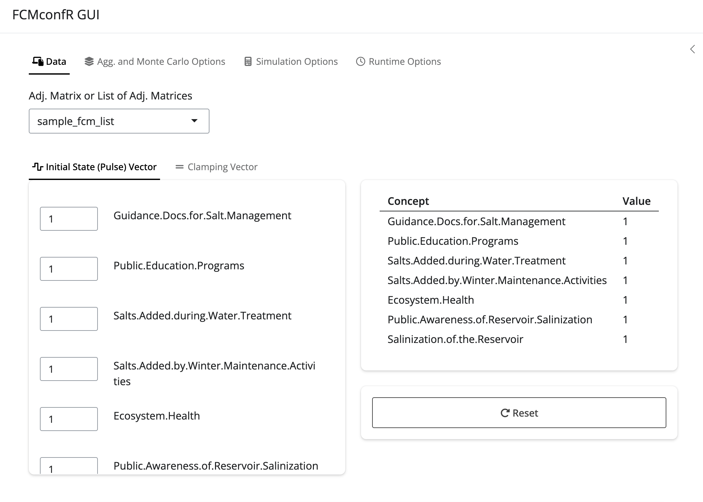

```{r, include = FALSE}
knitr::opts_chunk$set(
  collapse = TRUE,
  comment = "#>"
)
```

```{r eval=FALSE}
library(fcmconfr)
```

# The `fcmconfr` Workflow

`fcmconfr` streamlines FCM analysis and generally follows a 4-Step workflow:

1.  Import FCMs

2.  Use `fcmconfr_gui()` to Set Up Parameters

3.  Run `fcmconfr()`

4.  Explore `fcmconfr()` Results

This guide walks through a typical workflow and describes additional functions included in `fcmconfr` that can help give users more information throughout.

## 1. Import FCMs

One thing that makes `fcmconfr` unique is that it can handle different types of FCMs beyond the conventional format where edge weights are represented as individual numeric values. These include FCMs with edge weights represented as interval-value fuzzy numbers (IVFN-FCMs) and triangular fuzzy numbers (TFN-FCMs).

*For a more detailed guide for importing the three different types of FCMs compatible with `fcmconfr`, users are highly recommended to review the `Importing_FCMs` vignette.*

### 1.1 Importing Conventional FCMs

Importing Conventional FCMs involves straightforward calls to `readxl::read_excel()` or `read.csv()` (or similar functions for other file formats). Users planning to use `fcmconfr` to analyze multiple FCMs together should group them into a single `list` object.

```{r eval=FALSE}
# Import Conventional FCMs into the Global Environment
fcm_1 <- readxl::read_excel(fcm_1_filepath)
fcm_2 <- readxl::read_excel(fcm_2_filepath)
...
fcm_n <- readxl::read_excel(fcm_n_filepath)

# Group them together in a single list object
fcms <- list(fcm_1, fcm_2, ..., fcm_n)
```

### 1.2 Importing IVFN FCMs

For Conventional FCMs, each edge weight is an individual number, but IVFN FCMs have interval edge weights that by nature must be described by two values, a lower and upper bound to the interval. Unfortunately, .xlsx and .csv files can only store one value per "cell" so we have to get creative to combine multiple values into a single edge weight.

`fcmconfr` uses the `make_adj_matrix_w_ivfns()` function to make this happen. `make_adj_matrix_w_ivfns()` creates an IVFN FCM from an adjacency matrix of only the lower bounds for each edge weight and another adjacency matrix of only the upper bounds for each edge weight. This next example shows how this strategy works in practice.

```{r eval=FALSE}
# Import separate adjacency matrices representing the 
# lower and upper bounds of each edge weight
ivfn_fcm_1_lower_adj_matrix <- readxl::read_excel(ivfn_fcm_1_lower_adj_matrix_filepath)
ivfn_fcm_1_upper_adj_matrix <- readxl::read_excel(ivfn_fcm_1_upper_adj_matrix_filepath)

# Combine the lower and upper adjacency matrices to make an IVFN FCM
ivfn_fcm_1 <- make_adj_matrix_w_ivfns(
  ivfn_fcm_1_lower_adj_matrix, ivfn_fcm_1_upper_adj_matrix
)
```

Like with Conventional FCMs, group IVFN FCMs into a `list` object to analyze multiple at the same time in `fcmconfr()`

```{r eval=FALSE}
ivfn_fcms <- list(ivfn_fcm_1, ivfn_fcm_2, ..., ivfn_fcm_n)
```

### 1.3 Importing TFN FCMs

Importing TFN FCMs builds on the strategy used to import IVFN FCMs with the main difference that TFNs are described with three values, a lower and upper bound as well as a mode describing the most-likely value of the edge weight. So, `make_adj_matrix_w_tfns()` takes in three adjacency matrices (one for the lower bounds, one for the modes, and one for the upper bounds) make a TFN FCM, and it functions very similarly to `make_adj_matrix_w_ivfns()`.

```{r eval=FALSE}
# Import separate adjacency matrices representing the 
# lower and upper bounds as well as the mode  of each edge weight
ivfn_fcm_1_lower_adj_matrix <- readxl::read_excel(ivfn_fcm_1_lower_adj_matrix_filepath)
ivfn_fcm_1_mode_adj_matrix <- readxl::read_excel(ivfn_fcm_1_mode_adj_matrix_filepath)
ivfn_fcm_1_upper_adj_matrix <- readxl::read_excel(ivfn_fcm_1_upper_adj_matrix_filepath)

# Combine the lower and upper adjacency matrices to make an IVFN FCM
tfn_fcm_1 <- make_adj_matrix_w_tfns(
  tfn_fcm_1_lower_adj_matrix, tfn_fcm_1_mode_adj_matrix, tfn_fcm_1_upper_adj_matrix
)
```

Once again, group TFN FCMs into a `list` to analyze multiple at a time in `fcmconfr()`.

```{r eval=FALSE}
tfn_fcms <- list(tfn_fcm_1, tfn_fcm_2, ..., tfn_fcm_n)
```

### 1.4 Interacting with IVFN and TFN FCM Adjacency Matrix Elements

Unlike an ordinary matrix of numeric values, elements adjacency matrices made of IVFNs are technically list objects. Consider the `numeric_df` matrix given below:

```{r eval=FALSE}
numeric_df <- data.frame("C1" = c(0, 0.75), "C2" = c(0.5, 0))
numeric_df
```

We can access elements within `numeric_df` with indexing. For example, to get the element in the second column of the first row we can run `numeric_df[1, 2]` or `numeric_df$C2[1]` , both of which would return `0.5` .

```{r eval=FALSE}
numeric_df[1, 2] # Numeric Indexing
numeric_df$C2[1] # Column Indexing
```

Dataframes traditionally cannot be built from custom object classes like the `ivfn` and `tfn` classes defined for `fcmconfr`. However, `fcmconfr` works around this by storing `ivfn` and `tfn` objects within lists and then treating a dataframe of `ivfn` or `tfn` objects as a dataframe of lists that contain `ivfn` or `tfn` objects.

Since users can make `ivfn` or `tfn` adjacency matrices by importing matrices from files, they will rarely have to create an `ivfn` or `tfn` matrix from scratch, but it is valuable to provide a code example of how `fcmconfr` creates such objects.

```{r eval=FALSE}
# First, create a dataframe from a n x n matrix of lists
ivfn_df <- data.frame(matrix(data = list(), nrow = 2, ncol = 2))

# Then, place the ivfn/tfn within a list and define its location indeces
# Note that since ivfn_df is a matrix of lists, we have to define the new ivfn object as the first element of the list at index [1, 2], hence the need for [[1]].
ivfn_df[1, 1][[1]] <- list(ivfn(0, 0))
ivfn_df[1, 2][[1]] <- list(ivfn(0.4, 0.6))
ivfn_df[2, 1][[1]] <- list(ivfn(0.7, 0.8))
ivfn_df[2, 2][[1]] <- list(ivfn(0, 0))
```

::: {style="text-align: center;"}
{width="70%"}
:::

<br>

To get the `ivfn` at a particular location, then, if we simply call `ivfn_df[row, col]` that will return a list containing an `ivfn`. To get the `ivfn` by itself, add `[[1]]` to indicate the first value of the list object

::: {style="text-align: center;"}
{width="50%"}
:::

<br>

Now, say we want to separate the IVFN adjacency matrix back to its components of an adjacency matrix of lower bounds and another of upper bounds. Pairing `apply` with the above indexing strategy is an effective method here:

```{r eval=FALSE}
lower_adj_matrix <- apply(ivfn_df, c(1, 2), function(element) element[[1]]$lower)
upper_adj_matrix <- apply(ivfn_df, c(1, 2), function(element) element[[1]]$upper)
```

### 1.5 Viewing FCMs

Users may display FCMs in RStudio's Viewer pane using `fcm_view()` that plots an FCM (adjacency matrix) as a `visNetwork` object. The interactive plot is fairly rudimentary in that users may only manipulate node positions (i.e., node layout).

Two basic uses of `fcm_view()` are given below.

```{r eval=FALSE}
# Loading FCM from sample_fcms data
adj_matrix <- sample_fcms$simple_fcms$conventional_fcms[[1]]

# Show FCM in Viewer Pane
fcm_view(fcm_adj_matrix = adj_matrix)

# Show FCM in Separate Shiny App (returns visNetwork object in Global Environment)
fcm_view(fcm_adj_matrix = adj_matrix, with_shiny = TRUE)
```

::: {style="text-align: center;"}
{alt="visNetwork Output of fcm_view. Drag nodes to rearrange layout." width="80%"}
:::

`fcm_view()` has an additional argument `with_shiny` (default `with_shiny = FALSE`). If set to TRUE, plots FCM in a shiny app that records the `visNetwork` output in the global environment as `view_fcm_visNetwork_output`. This has two functionalities, 1) the output variable will store node coordinates so nodes will be plotted in the same position if manipulated by the user and 2) the output variable may be interacted with as a typical `visNetwork` object for users wanting additional customization.

Note: For IVFN and TFN FCMs, `fcm_view()` plots the average edge weight to simplify the output. At its core, `fcm_view()` is just a call to a few `visNetwork` functions. Users with experience with `visNetwork` should feel free to plot FCMs directly with `visNetwork` for outputs with greater detail.

## 2. Use `fcmconfr_gui()` to Set Up Parameters

The primary `fcmconfr()` function is the central function of the package and performs many different analyses, so as a result it has many different parameters. `fcmconfr` includes the `fcmconfr_gui()` function to help guide users through parameter selection.

`fcmconfr_gui()` performs two tasks: at runtime it launches a shiny app that lets users interactively select parameters and then outputs the corresponding call to `fcmconfr()` in the console that users can copy-and-paste to run in their own scripts.

While `fcmconfr_gui()` cannot itself be passed any inputs, it does require the local environment to have either an individual FCM or a list of FCMs object (which are selected within the gui) to work (accepts Conventional FCMs, IVFN FCMs, or TFN FCMs).

Once the FCMs are imported into the Global Environment and grouped in a `list` object, call `fcmconfr_gui()` by itself to launch the gui.

```{r eval=FALSE}
fcmconfr_gui()
```

::: {style="text-align: center;"}
{width="90%"}
:::

`fcmconfr_gui` is organized into four tabs: Data, Agg. and Monte Carlo Options, Simulation Options, and Runtime Options.

-   Data: Select FCMs to analyze and change values in the Initial State (Pulse) Vector or Clamping Vector to see how different concepts influence the system. (Note: Best practices in the FCM literature leave every value in the Initial State Vector at 1 and set only the node-of-interest to 1 in the Clamping Vector)

-   Agg. and Monte Carlo Options: What methods should be used for Aggregation and Monte Carlo sampling? Users may toggle either on/off depending on whether they want to perform only one or the other. Also contains Bootstrap sampling parameters for estimating confidence intervals about the average inferences from simulations of the Monte Carlo-generated FCMs.

-   Simulation Options: Select the activation and squashing functions along with the lambda value and additional relevant parameters (most are fine as their default values)

-   Runtime Options: Options for parallel processing and progress bars to display in the console at runtime. These have no impact on the actual output, and only influence how long `fcmconfr()` takes to run and what the user sees while `fcmconfr()` is running.

Note: There are many resources across the FCM literature that describe each parameter in `fcmconfr_gui` in greater detail. Users seeking a brief summary of each parameter, however, can find these in a glossary stored in a side tab opened from the arrow in the top-right of the gui.

Once finished selecting parameters, scroll down in the gui and click the Submit button to get the corresponding call to `fcmconfr()` in the console (Exiting out of the gui will NOT work, users must select Submit to get the text output in the console). The following code is an example output from `fcmconfr_gui()`.

```{r eval=FALSE}
fcmconfr(
  adj_matrices = sample_fcm_list,
  # Aggregation and Monte Carlo Sampling
  agg_function = 'mean',
  num_mc_fcms = 1000,
  # Simulation
  initial_state_vector = c(1, 1, 1, 1, 1, 1, 1),
  clamping_vector = c(1, 0, 0, 0, 0, 0, 0),
  activation = 'rescale',
  squashing = 'sigmoid',
  lambda = 1,
  point_of_inference = 'final',
  max_iter = 100,
  min_error = 1e-05,
  # Inference Estimation (bootstrap)
  ci_centering_function = 'mean',
  confidence_interval = 0.95,
  num_ci_bootstraps = 1000,
  # Runtime Options
  show_progress = TRUE,
  parallel = TRUE,
  n_cores = 2,
  # Additional Options
  run_agg_calcs = TRUE,
  run_mc_calcs = TRUE,
  run_ci_calcs = TRUE,
  include_zeroes_in_sampling = FALSE,
  mc_sims_in_output = FALSE
)
```

Copy-and-paste the console output into another file and define the call to `fcmconfr()` in a variable (such as `sample_fcms_fcmconfr`) to store the output.

```{r eval=FALSE}
sample_fcms_fcmconfr <- fcmconfr(
  adj_matrices = sample_fcm_list,
  # Aggregation and Monte Carlo Sampling
  agg_function = 'mean',
  num_mc_fcms = 1000,
  # Simulation
  initial_state_vector = c(1, 1, 1, 1, 1, 1, 1),
  clamping_vector = c(1, 0, 0, 0, 0, 0, 0),
  activation = 'rescale',
  squashing = 'sigmoid',
  lambda = 1,
  point_of_inference = 'final',
  max_iter = 100,
  min_error = 1e-05,
  # Inference Estimation (bootstrap)
  ci_centering_function = 'mean',
  confidence_interval = 0.95,
  num_ci_bootstraps = 1000,
  # Runtime Options
  show_progress = TRUE,
  parallel = TRUE,
  n_cores = 2,
  # Additional Options
  run_agg_calcs = TRUE,
  run_mc_calcs = TRUE,
  run_ci_calcs = TRUE,
  include_zeroes_in_sampling = FALSE,
  mc_sims_in_output = FALSE
)
```

## 3. Run `fcmconfr()`

Since `fcmconfr_gui()` did all the hard work of putting together the call to `fcmconfr()` with our selected parameters, users just need to run that output script and `fcmconfr` takes it from there.

## 4. Explore `fcmconfr()` Results

Across running simulations for each individual FCM, calculating an aggregate FCM, generating many empirical FCMs from monte carlo sampling, and bootstrapping confidence intervals, `fcmconfr()` returns a fairly large object that contains a lot of data. Users are encouraged to explore the `fcmconfr()` output data structure, but `fcmconfr` comes with a few functions to help parse through it.

### 4.1 Getting Inferences

Inferences are the main result from an FCM simulation, representing how much a node was influenced by a particular change or action. In an `fcmconfr()` output object, inferences are stored a few layers in at:

```{r eval=FALSE}
individual_fcm_inferences <- fcmconfr_obj$inferences$individual_fcms$inferences
aggregate_fcm_inferences <- fcmconfr_obj$inferences$aggregate_fcm$inferences
mc_fcm_inferences <- fcmconfr_obj$inferences$monte_carlo_fcms$all_inferences
CIs_of_avg_mc_fcm_inferences <- fcmconfr_obj$inferences$monte_carlo_fcms$bootstrap$CIs_and_quantiles_by_node
```

Rather than search for inference data manually like above, `fcmconfr` offers the `get_inferences()` function to retrieve and store inference results in a single line. Compare the code above to the following line:

```{r eval=FALSE}
fcmconfr_inferences <- get_inferences(fcmconfr_obj, analysis = c("individual", "aggregate", "mc"))
```

`get_inferences()` returns a list of dataframes with the inferences for each analysis (by default, `analysis = c("individual", "aggregate", "mc")`, but users may select any one or two as well to reduce the size of the output.

When "mc" is included in `analysis`, `get_inferences()` returns both the inferences from each empirical monte carlo FCM and a dataframe that includes the bootstrapped confidence intervals about the average monte carlo FCM inferences.

### 4.2 Plotting `fcmconfr()` Results

Run `plot(fcmconfr_obj)` to generate a plot of all inferences included in the output of `fcmconfr()`.

Note that `plot()` is a versatile function in R in that it works differently depending on the type of input or what package is calling it. To view the documentation for the version of `plot()` used for `fcmconfr` output objects, type `?plot.fcmconfr` into the console.

`plot.fcmconfr()` takes many additional inputs, the defaults of which are given below. This is what `plot` calls if passed only an `fcmconfr` output object without any additional parameters.

```{r eval=FALSE}
# Plot Defaults
plot(fcmconfr_obj,
     interactive = FALSE, # Set to TRUE to open shiny app
     # Plot Formatting Parameters
     filter_limit = 1e-4,
     xlim = NA, # Accepts c(lower_limit, upper_limit) inputs
     coord_flip = FALSE,
     # Plot Aesthetic Parameters
     mc_avg_and_CIs_color = "blue",
     mc_inferences_color = "blue",
     mc_inferences_alpha = 0.1,
     mc_inferences_shape = 3,
     ind_inferences_color = "black",
     ind_inferences_alpha = 1,
     ind_inferences_shape = 16,
     agg_inferences_color = "red",
     agg_inferences_alpha = 1,
     agg_inferences_shape = 17,
     ind_ivfn_and_tfn_linewidth = 0.1,
     agg_ivfn_and_tfn_linewidth = 0.6
)
```

A majority of these parameters describe how points from different analyses are plotted. Any or all of these parameters can be included in a call to `plot` when plotting `fcmconfr` output objects. Alpha changes the point transparency with 1 being opaque and 0 being completely transparent.

Notice the `interactive` parameter. Include `interactive = TRUE` to launch the plot inside a shiny app to toggle the results from different analyses on/off. This is a great option for exploring early results. (You may need to play with the text font size in the app to get a better view of the axis labels).

```{r eval=FALSE}
plot(stkhldr_fcms_fcmconfr_guidance_docs,
     interactive = TRUE,
     xlim = c(-0.5, 0.5))
```

::: {style="text-align: center;"}
{width="100%"}
:::
