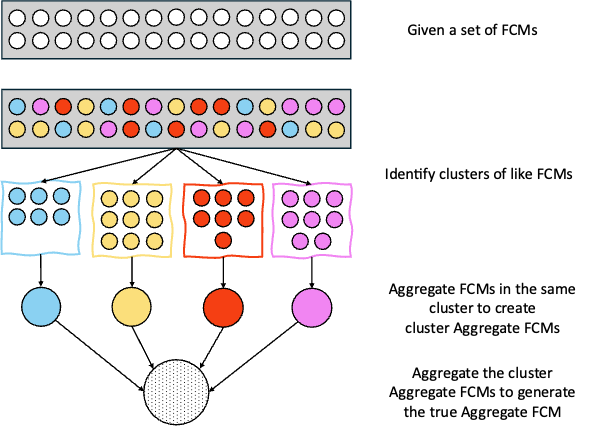
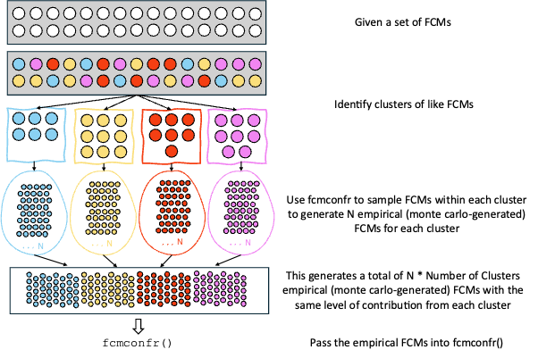
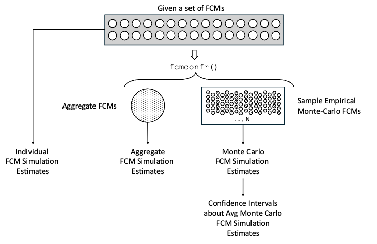

```{r include = FALSE}
knitr::opts_chunk$set(
  collapse = TRUE,
  comment = "#>"
)

if (!identical("", system.file(package = 'devtools'))) {
  devtools::load_all()
}
```

```{r eval=FALSE}
library(fcmconfr)
```

# Problem Setup and Description

It is a common practice when working with stakeholder FCMs to group FCMs in like clusters prior to aggregating them to generate broader, population-scale results.

Let's walkthrough how `fcmconfr` can both streamline and expand upon this type of analysis using conventional FCMs from the `sample_fcms` data set included in the package.

```{r}
stkhldr_fcms <- sample_fcms$simple_fcms$conventional_fcms
```

Note: The steps to perform this analysis are the same for IVFN/TFN FCMs, with differences in importing adjacency matrices into R and the type of data given in the final output (i.e. IVFNs or TFNs)

`stkhldr_fcms` is a list of 30 FCM adjacency matrices representing different perspectives on how rising salinization in a reservoir impacts a community and its surroundings as well as what actions may help manage the problem.

## Aggregation Approach

Suppose that prior to using `fcmconfr` we performed a Principal Component Analysis (PCA) that identified four clusters of similar FCMs. We could then either manually or with `fcmconfr` calculate the aggregate FCM by aggregating the cluster aggregates. The figure below illustrates this process.



<br>

A limitation of this analysis is that it cannot propagate error throughout each additional level of aggregation, so there is no way to estimate the precision of the true aggregate's edge weights. Additionally, without the ability to infer confidence intervals, we cannot understand how well this aggregate model describes the possibility space generated from the 30 unique input models.

## Monte Carlo Approach

Using the monte-carlo sampling capability of `fcmconfr` we can try a different approach. Again, use PCA or a similar analysis to identify clusters of like FCMs. Then, use `fcmconfr()` to generate (N) maps representative of each cluster's possibility space by sampling edges and their weights from FCMs within the cluster. Combine these newly created empirical, monte-carlo-generated FCMs into a list object with each cluster represented with the same number (N) of entries (Num. FCMs = Num Clusters \* N). Finally, pass this list into the `fcmconfr` function. The following figure illustrates this expanded process.



## Using `fcmconfr`

Let's see how `fcmconfr` lets us perform not just the monte-carlo approach but also compare how the results from the two approaches with just a few function calls.

First, let's assume the given information about the relevant clusters and which FCMs are included in each.

```{r}
cluster_1_fcms <- stkhldr_fcms[c(1, 5, 11, 18, 22, 28)]
cluster_2_fcms <- stkhldr_fcms[c(2, 7, 13, 14, 15, 20, 24, 26)]
cluster_3_fcms <- stkhldr_fcms[c(3, 6, 9, 10, 21, 23, 27)]
cluster_4_fcms <- stkhldr_fcms[c(4, 8, 12, 16, 17, 19, 25, 29, 30)]
```

Next we'll need to consider our simulation options, mainly, which concept or node should we "push" to see how how that particular concept influences the system as represented across these FCMs. There are 7 concepts representing different actions, causes, and factors affected in relation to the central concept of salinization of the reservoir. Say we are considering how two different actions, Guidance.Docs.for.Salt.Management and Public.Education.Programs, may influence the system based on our stakeholders perspectives. We will need to "push" these two variables in two separate calls to `fcmconfr()`.

|                 |                                              |
|-----------------|----------------------------------------------|
| Action          | Guidance.Docs.for.Salt.Management            |
| Action          | Public.Education.Programs                    |
| Cause           | Salts.Added.during.Water.Treatment           |
| Cause           | Salts.Added.by.Winter.Maintenance.Activities |
| Factor Affected | Ecosystem.Health                             |
| Factor Affected | Public.Awareness.of.Reservoir.Salinization   |
| Central Concept | Salinization.of.the.Reservoir                |

### The Aggregation Approach with fcmconfr

After loading the FCM cluster lists into the Global Environment we can call `fcmconfr_gui` to create our call to the `fcmconfr()` to help select our nodes to test and the many other inputs to `fcmconfr()`. Call `fcmconfr_gui()` by itself to launch the help gui as displayed in the following figure.

```{r eval=FALSE}
fcmconfr_gui()
```


For the Aggregate approach, under the Agg. and Monte Carlo Opts tab, leave the Aggregation Analysis box checked and remove the check from the box for Monte Carlo Analysis. Likewise, for the Monte Carlo approach, remove the check from the Aggregation Analysis box and make sure the Monte Carlo Analysis box is checked instead.

In the Simulation Options tab we can select our parameters for the actual simulations of our FCM models. These parameters are described in greater detail throughout the FCM literature and are not described here, though definitions are given in the gui via a side tab accessible by clicking the arrow in the gui's top-right corner.

For this example, set the Activation Function to Rescale and leave the rest of the parameters as they are. The defaults are typical values used in practice. `fcmconfr` will suggest changes to these if any are influencing the analysis enought to warrant further attention.

Finally, the Runtime Options tab lets users select whether they want to leverage their local machine's parallel processing capabilities and whether to show the function's progress during runtime. `fcmconfr` can take anywhere from seconds to minutes to half an hour and more given a complicated enough input. These options have NO impact on results and ONLY influence the runtime length and what users see from the console while `fcmconfr()` is running.

Once finished, click Submit at the bottom of the gui. This will output a call to `fcmconfr()` with the selected inputs in the console that users can copy-and-paste into a separate file and run. For example, the fcmconfr_gui output described here returns:

```{r eval=FALSE}
fcmconfr(
  adj_matrices = cluster_1_fcms,
  # Aggregation
  agg_function = 'mean',
  # Simulation
  initial_state_vector = c(1, 1, 1, 1, 1, 1, 1),
  clamping_vector = c(1, 0, 0, 0, 0, 0, 0),
  activation = 'rescale',
  squashing = 'sigmoid',
  lambda = 1,
  point_of_inference = 'final',
  max_iter = 100,
  min_error = 1e-05,
  # Runtime Options
  show_progress = TRUE,
  # Additional Options
  run_agg_calcs = TRUE,
  run_mc_calcs = FALSE,
  run_ci_calcs = FALSE,
  include_zeroes_in_sampling = FALSE
)
```

In another file, we copy-and-paste the call to `fcmconfr()` and ascribe it to a variable `cluster_1_fcmconfr`. We then copy-and-paste that the `cluster_1_fcmconfr` call to create separate `cluster_2_fcmconfr` , `cluster_3_fcmconfr`, and `cluster_4_fcmconfr` calls. Note that the ONLY difference in calls is the `adj_matrices` parameter is changed to reflect the particular cluster.

```{r eval=FALSE}
cluster_1_fcmconfr <- fcmconfr(
  adj_matrices = cluster_1_fcms, # ONLY CHANGE THIS PARAM
  # Aggregation
  agg_function = 'mean',
  # Simulation
  initial_state_vector = c(1, 1, 1, 1, 1, 1, 1),
  clamping_vector = c(1, 0, 0, 0, 0, 0, 0),
  activation = 'rescale',
  squashing = 'sigmoid',
  lambda = 1,
  point_of_inference = 'final',
  max_iter = 100,
  min_error = 1e-05,
  # Runtime Options
  show_progress = TRUE,
  # Additional Options
  run_agg_calcs = TRUE,
  run_mc_calcs = FALSE,
  run_ci_calcs = FALSE,
  include_zeroes_in_sampling = FALSE
)

cluster_2_fcmconfr <- fcmconfr(
  adj_matrices = cluster_2_fcms, # ONLY CHANGE THIS PARAM
  # Aggregation
  agg_function = 'mean',
  # Simulation
  initial_state_vector = c(1, 1, 1, 1, 1, 1, 1),
  clamping_vector = c(1, 0, 0, 0, 0, 0, 0),
  activation = 'rescale',
  squashing = 'sigmoid',
  lambda = 1,
  point_of_inference = 'final',
  max_iter = 100,
  min_error = 1e-05,
  # Runtime Options
  show_progress = TRUE,
  # Additional Options
  run_agg_calcs = TRUE,
  run_mc_calcs = FALSE,
  run_ci_calcs = FALSE,
  include_zeroes_in_sampling = FALSE
)

cluster_3_fcmconfr <- fcmconfr(
  adj_matrices = cluster_3_fcms, # ONLY CHANGE THIS PARAM
  # Aggregation
  agg_function = 'mean',
  # Simulation
  initial_state_vector = c(1, 1, 1, 1, 1, 1, 1),
  clamping_vector = c(1, 0, 0, 0, 0, 0, 0),
  activation = 'rescale',
  squashing = 'sigmoid',
  lambda = 1,
  point_of_inference = 'final',
  max_iter = 100,
  min_error = 1e-05,
  # Runtime Options
  show_progress = TRUE,
  # Additional Options
  run_agg_calcs = TRUE,
  run_mc_calcs = FALSE,
  run_ci_calcs = FALSE,
  include_zeroes_in_sampling = FALSE
)

cluster_4_fcmconfr <- fcmconfr(
  adj_matrices = cluster_4_fcms, # ONLY CHANGE THIS PARAM
  # Aggregation
  agg_function = 'mean',
  # Simulation
  initial_state_vector = c(1, 1, 1, 1, 1, 1, 1),
  clamping_vector = c(1, 0, 0, 0, 0, 0, 0),
  activation = 'rescale',
  squashing = 'sigmoid',
  lambda = 1,
  point_of_inference = 'final',
  max_iter = 100,
  min_error = 1e-05,
  # Runtime Options
  show_progress = TRUE,
  # Additional Options
  run_agg_calcs = TRUE,
  run_mc_calcs = FALSE,
  run_ci_calcs = FALSE,
  include_zeroes_in_sampling = FALSE
)
```

For this step, we are only interested in the aggregate adjacency matrices from each cluster which is stored as: `fcmconfr_obj$aggregate_adj_matrix$adj_matrix` . Using `lapply` we can easily get the adjacency matrices from each cluster.

```{r eval=FALSE}
# Get aggregate adj. matrix from a single fcmconfr output
cluster_1_aggregate_fcm <- cluster_1_fcmconfr$aggregate_adj_matrix$adj_matrix

# Get a list of aggregate adj. matrices from multiple fcmconfr outputs
# Notice the fcmconfr outputs are grouped in a call to list(), NOT c()
cluster_aggregate_fcms <- lapply(
  list(cluster_1_fcmconfr, cluster_2_fcmconfr, cluster_3_fcmconfr, cluster_4_fcmconfr),
  function(fcmconfr_obj) {
    fcmconfr_obj$aggregate_adj_matrix$adj_matrix
  }
)
```

Then, using nearly the same `fcmconfr()` code we used above, copy-and-paste that code again but this time set the `adj_matrices` parameter to the newly-created `cluster_aggregate_fcms` object:

```{r eval=FALSE}
cluster_aggregate_fcms_fcmconfr <- fcmconfr(
  adj_matrices = cluster_aggregate_fcms, # ONLY CHANGE THIS PARAM
  # Aggregation
  agg_function = 'mean',
  # Simulation
  initial_state_vector = c(1, 1, 1, 1, 1, 1, 1),
  clamping_vector = c(1, 0, 0, 0, 0, 0, 0),
  activation = 'rescale',
  squashing = 'sigmoid',
  lambda = 1,
  point_of_inference = 'final',
  max_iter = 100,
  min_error = 1e-05,
  # Runtime Options
  show_progress = TRUE,
  # Additional Options
  run_agg_calcs = TRUE,
  run_mc_calcs = FALSE,
  run_ci_calcs = FALSE,
  include_zeroes_in_sampling = FALSE
)
```

Use `plot(cluster_aggreagate_fcms_fcmconfr)` to view the results of the Aggregate approach. Then, repeat by first calling `fcmconfr_gui` again and, under the Clamping Vector tab, setting Public.Education.Programs to 1 and leaving Guidance.Docs.for.Salt.Management at 0. The plots for both analyses are given below.

```{r, eval=FALSE}
plot(cluster_aggregate_fcms_fcmconfr, xlim = c(-0.4, 0.4))
```


### The Monte Carlo Approach with fcmconfr

As `fcmconfr` is designed to run both aggregation and monte carlo analyses, performing the Monte Carlo approach is very similar to the Aggregation approach but with a few key differences.

After loading the FCM cluster lists into the Global Environment we can call `fcmconfr_gui` to create our call to the `fcmconfr()` to help select our nodes to test and the many other inputs to `fcmconfr()`. Call `fcmconfr_gui()` by itself to launch the help gui as displayed in the following figure.

```{r eval=FALSE}
fcmconfr_gui()
```

{alt="After selecting cluster_1_fcms as the List of Adj. Matrices, switch to the Clamping Vector tab displayed as displayed in the figure and set the value for Guidance.Docs.for.Salt.Management to 1."}

For the Monte Carlo approach, remove the check from the Aggregation Analysis box and make sure the Monte Carlo Analysis box is checked instead.

There are additional parameters to define under the Monte Carlo and Bootstrap sections. Reduce the \# Sample Maps to Generate to 100 or something smaller for this example to reduce the runtime and load on your machine. Understand, though, that in practice the \# Sample Maps to Generate should be at least 1000.

The rest of the defaults will be appropriate for this example, but users with experience in monte carlo and bootstrapping methods should feel free to play with these values.

{width="90%"}

In the Simulation Options tab we can select our parameters for the actual simulations of our FCM models. These parameters are described in greater detail throughout the FCM literature and are not described here, though definitions are given in the gui via a side tab accessible by clicking the arrow in the gui's top-right corner.

The Runtime Options tab lets users select whether they want to leverage their local machine's parallel processing capabilities and whether to show the function's progress during runtime. `fcmconfr` can take anywhere from seconds to minutes to half an hour and more given a complicated enough input. These options have NO impact on results and ONLY influence the runtime length and what users see from the console while `fcmconfr()` is running.

Once finished, click Submit at the bottom of the gui. This will output a call to `fcmconfr()` with the selected inputs in the console that users can copy-and-paste into a separate file and run. For example, the fcmconfr_gui output described here returns:

```{r eval=FALSE}
fcmconfr(
  adj_matrices = cluster_1_fcms,
  # Monte Carlo Sampling
  num_mc_fcms = 100, # New param for Monte Carlo
  # Simulation
  initial_state_vector = c(1, 1, 1, 1, 1, 1, 1),
  clamping_vector = c(0, 1, 0, 0, 0, 0, 0),
  activation = 'rescale',
  squashing = 'sigmoid',
  lambda = 1,
  point_of_inference = 'final',
  max_iter = 100,
  min_error = 1e-05,
  # Inference Estimation (bootstrap)
  ci_centering_function = 'mean', # New param for Bootstrap
  confidence_interval = 0.95, # New param for Bootstrap
  num_ci_bootstraps = 1000, # New param for Bootstrap
  # Runtime Options
  show_progress = TRUE,
  # Additional Options
  run_agg_calcs = FALSE,
  run_mc_calcs = TRUE,
  run_ci_calcs = TRUE,
  include_zeroes_in_sampling = FALSE,
  mc_sims_in_output = FALSE
)
```

In another file, we copy-and-paste the call to `fcmconfr()` and ascribe it to a variable `cluster_1_fcmconfr`. We then copy-and-paste that the `cluster_1_fcmconfr` call to create separate `cluster_2_fcmconfr` , `cluster_3_fcmconfr`, and `cluster_4_fcmconfr` calls. Note that the ONLY difference in calls is the `adj_matrices` parameter is changed to reflect the particular cluster.

```{r eval=FALSE}
cluster_1_fcmconfr <- fcmconfr(
  adj_matrices = cluster_1_fcms,
  # Monte Carlo Sampling
  num_mc_fcms = 100, # New param for Monte Carlo
  # Simulation
  initial_state_vector = c(1, 1, 1, 1, 1, 1, 1),
  clamping_vector = c(1, 0, 0, 0, 0, 0, 0),
  activation = 'rescale',
  squashing = 'sigmoid',
  lambda = 1,
  point_of_inference = 'final',
  max_iter = 100,
  min_error = 1e-05,
  # Inference Estimation (bootstrap)
  ci_centering_function = 'mean', # New param for Bootstrap
  confidence_interval = 0.95, # New param for Bootstrap
  num_ci_bootstraps = 1000, # New param for Bootstrap
  # Runtime Options
  show_progress = TRUE,
  # Additional Options
  run_agg_calcs = FALSE,
  run_mc_calcs = TRUE,
  run_ci_calcs = TRUE,
  include_zeroes_in_sampling = FALSE,
  mc_sims_in_output = FALSE
)

cluster_2_fcmconfr <- fcmconfr(
  adj_matrices = cluster_2_fcms,
  # Monte Carlo Sampling
  num_mc_fcms = 100, # New param for Monte Carlo
  # Simulation
  initial_state_vector = c(1, 1, 1, 1, 1, 1, 1),
  clamping_vector = c(1, 0, 0, 0, 0, 0, 0),
  activation = 'rescale',
  squashing = 'sigmoid',
  lambda = 1,
  point_of_inference = 'final',
  max_iter = 100,
  min_error = 1e-05,
  # Inference Estimation (bootstrap)
  ci_centering_function = 'mean', # New param for Bootstrap
  confidence_interval = 0.95, # New param for Bootstrap
  num_ci_bootstraps = 1000, # New param for Bootstrap
  # Runtime Options
  show_progress = TRUE,
  # Additional Options
  run_agg_calcs = FALSE,
  run_mc_calcs = TRUE,
  run_ci_calcs = TRUE,
  include_zeroes_in_sampling = FALSE,
  mc_sims_in_output = FALSE
)

cluster_3_fcmconfr <- fcmconfr(
  adj_matrices = cluster_3_fcms,
  # Monte Carlo Sampling
  num_mc_fcms = 100, # New param for Monte Carlo
  # Simulation
  initial_state_vector = c(1, 1, 1, 1, 1, 1, 1),
  clamping_vector = c(1, 0, 0, 0, 0, 0, 0),
  activation = 'rescale',
  squashing = 'sigmoid',
  lambda = 1,
  point_of_inference = 'final',
  max_iter = 100,
  min_error = 1e-05,
  # Inference Estimation (bootstrap)
  ci_centering_function = 'mean', # New param for Bootstrap
  confidence_interval = 0.95, # New param for Bootstrap
  num_ci_bootstraps = 1000, # New param for Bootstrap
  # Runtime Options
  show_progress = TRUE,
  # Additional Options
  run_agg_calcs = FALSE,
  run_mc_calcs = TRUE,
  run_ci_calcs = TRUE,
  include_zeroes_in_sampling = FALSE,
  mc_sims_in_output = FALSE
)

cluster_4_fcmconfr <- fcmconfr(
  adj_matrices = cluster_4_fcms,
  # Monte Carlo Sampling
  num_mc_fcms = 100, # New param for Monte Carlo
  # Simulation
  initial_state_vector = c(1, 1, 1, 1, 1, 1, 1),
  clamping_vector = c(1, 0, 0, 0, 0, 0, 0),
  activation = 'rescale',
  squashing = 'sigmoid',
  lambda = 1,
  point_of_inference = 'final',
  max_iter = 100,
  min_error = 1e-05,
  # Inference Estimation (bootstrap)
  ci_centering_function = 'mean', # New param for Bootstrap
  confidence_interval = 0.95, # New param for Bootstrap
  num_ci_bootstraps = 1000, # New param for Bootstrap
  # Runtime Options
  show_progress = TRUE,
  # Additional Options
  run_agg_calcs = FALSE,
  run_mc_calcs = TRUE,
  run_ci_calcs = TRUE,
  include_zeroes_in_sampling = FALSE,
  mc_sims_in_output = FALSE
)
```

Now, rather than look at the aggregates for each cluster's `fcmconfr` output, we want to get the empirical adjacency matrices generated via monte carlo sampling. Empirical adjacency matrices are stored at `fcmconfr_obj$mc_adj_matrices`

```{r eval=FALSE}
# Get monte carlo adj. matrices from a single fcmconfr output
cluster_1_mc_fcms <- cluster_1_fcmconfr$mc_adj_matrices

# Get a list of monte carlo adj. matrices from multiple fcmconfr outputs
# Notice the fcmconfr outputs are grouped in a call to list(), NOT c()
all_clusters_mc_fcms <- do.call(c, lapply(
  list(cluster_1_fcmconfr, cluster_2_fcmconfr, cluster_3_fcmconfr, cluster_4_fcmconfr),
  function(fcmconfr_obj) {
    fcmconfr_obj$mc_adj_matrices
  }
))
```

Then, using nearly the same `fcmconfr()` code we used above, copy-and-paste that code again but this time set the `adj_matrices` parameter to the newly-created `cluster_mc_fcms` object. Also, the `num_mc_fcms` param needs to be at least double the number of input adjacency matrices.

Since at this point we're up to 400 input adjacency matrices, `num_mc_fcms` should be at least 800, but remember in practice we would have generated 1000 monte carlo FCMs for each cluster meaning this next step may need `num_mc_fcms = 8000` or greater! This is where parallel processing can become particularly useful. We can remove the check from the Include MC Sims in Output? to reduce the size of the output.

Rerun `fcmconfr_gui()` to change the `num_mc_fcm` parameter (\# Sample Maps to Generate in the gui) and parallel processing options (or edit code manually if comfortable).

Run the revised call to `fcmconfr()` with empirical FCMs from each cluster. This might take a few minutes (maybe even more than a few minutes). Note: Pair `fcmconfr()` with the `beepr` package to have your machine make a noise when it is finished.

```{r eval=FALSE}
all_clusters_mc_fcms_fcmconfr <- fcmconfr(
  adj_matrices = all_clusters_mc_fcms,
  # Monte Carlo Sampling
  num_mc_fcms = 800, # This needs to be AT LEAST DOUBLE length(all_clusters_mc_fcms)
  # Simulation
  initial_state_vector = c(1, 1, 1, 1, 1, 1, 1),
  clamping_vector = c(1, 0, 0, 0, 0, 0, 0),
  activation = 'rescale',
  squashing = 'sigmoid',
  lambda = 1,
  point_of_inference = 'final',
  max_iter = 100,
  min_error = 1e-05,
  # Inference Estimation (bootstrap)
  ci_centering_function = 'mean',
  confidence_interval = 0.95,
  num_ci_bootstraps = 1000,
  # Runtime Options
  show_progress = TRUE,
  parallel = TRUE,
  n_cores = 2,
  # Additional Options
  run_agg_calcs = FALSE,
  run_mc_calcs = TRUE,
  run_ci_calcs = TRUE,
  include_zeroes_in_sampling = FALSE,
  mc_sims_in_output = FALSE
)
```

Use `plot(all_clusters_mc_fcms_fcmconfr)` to view the results of the Monte Carlo approach. Then, repeat by first calling `fcmconfr_gui` again and, under the Clamping Vector tab, setting Public.Education.Programs to 1 and leaving Guidance.Docs.for.Salt.Management at 0. The plots for both analyses are given below.

```{r eval=FALSE}
plot(all_clusters_mc_fcms_fcmconfr, xlim = c(-0.4, 0.4))
```


Note how the individual FCMs estimate data take up a lot of the figure. Plot takes some additional arguments to help out with situations like these. See the plotting section later on in this article for more information. For now, we'll just play with arguments that will help with this current plot.

```{r eval=FALSE}
plot(all_clusters_mc_fcms_fcmconfr,
     # Plot Formatting Parameters
     xlim = c(-0.4, 0.4),
     # Plot Aesthetic Parameters
     ind_inferences_alpha = 0.1,
     ind_inferences_shape = 20
)
```


## The `fcmconfr` Approach

The above example walks through how to use `fcmconfr` to sample from the possibility spaces of various clusters of FCMs. Part of the inspiration for the two-level aggregation method is to return estimates that better represent the possibility space of the input FCMs given the lacking ability to propogate error (i.e. lacking precision).

By sampling from the input FCMs directly to generate empirical Monte-Carlo FCMs, `fcmconfr` can estimate confidence intervals, and thus potential error, at the group level in a single function call (see figure below).

{width="100%"}

Call `fcmconfr_gui()`, but this time select the raw `stkhldr_fcms` list of adjacency matrices and leave both the Aggregation Analysis and Monte Carlo Analysis boxes checked. Using Rescale again for the Squashing Function (Simulation Options) and setting the Clamping Vector value for Guidance.Docs.for.Salt.Management to 1 (or Public.Education.Programs for comparative analysis), generate a new call to `fcmconfr()`

```{r eval=FALSE}
# Scenario: Guidance.Docs.for.Salt.Management
stkhldr_fcms_fcmconfr_guidance_docs <- fcmconfr(
  adj_matrices = stkhldr_fcms,
  # Aggregation and Monte Carlo Sampling
  agg_function = 'mean',
  num_mc_fcms = 1000,
  # Simulation
  initial_state_vector = c(1, 1, 1, 1, 1, 1, 1),
  clamping_vector = c(1, 0, 0, 0, 0, 0, 0),
  activation = 'rescale',
  squashing = 'sigmoid',
  lambda = 1,
  point_of_inference = 'final',
  max_iter = 100,
  min_error = 1e-05,
  # Inference Estimation (bootstrap)
  ci_centering_function = 'mean',
  confidence_interval = 0.95,
  num_ci_bootstraps = 1000,
  # Runtime Options
  show_progress = TRUE,
  parallel = TRUE,
  n_cores = 2,
  # Additional Options
  run_agg_calcs = TRUE,
  run_mc_calcs = TRUE,
  run_ci_calcs = TRUE,
  include_zeroes_in_sampling = FALSE,
  mc_sims_in_output = FALSE
)

# Scenario: Public.Education.Programs
stkhldr_fcms_fcmconfr_education <- fcmconfr(
  adj_matrices = stkhldr_fcms,
  # Aggregation and Monte Carlo Sampling
  agg_function = 'mean',
  num_mc_fcms = 1000,
  # Simulation
  initial_state_vector = c(1, 1, 1, 1, 1, 1, 1),
  clamping_vector = c(0, 1, 0, 0, 0, 0, 0),
  activation = 'rescale',
  squashing = 'sigmoid',
  lambda = 1,
  point_of_inference = 'final',
  max_iter = 100,
  min_error = 1e-05,
  # Inference Estimation (bootstrap)
  ci_centering_function = 'mean',
  confidence_interval = 0.95,
  num_ci_bootstraps = 1000,
  # Runtime Options
  show_progress = TRUE,
  parallel = TRUE,
  n_cores = 2,
  # Additional Options
  run_agg_calcs = TRUE,
  run_mc_calcs = TRUE,
  run_ci_calcs = TRUE,
  include_zeroes_in_sampling = FALSE,
  mc_sims_in_output = FALSE
)
```

Then, view the outputs using `plot()` and set `xlim = c(-0.5, 0.5)` to compare the results more evenly across plots.

```{r eval = FALSE}
plot(stkhldr_fcms_fcmconfr_guidance_docs, xlim = c(-0.5, 0.5))
plot(stkhldr_fcms_fcmconfr_education, xlim = c(-0.5, 0.5))
```


